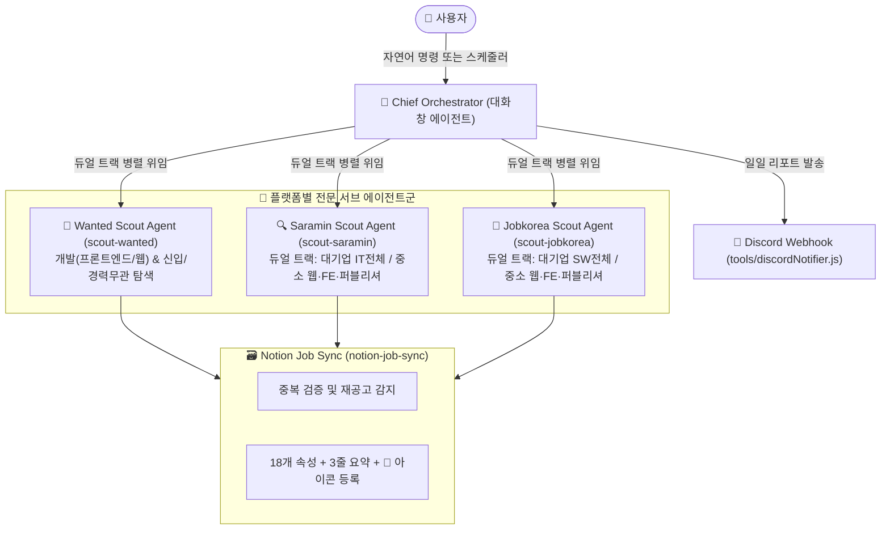

# 🤖 Antigravity Multi-Agent Job Scraping System

> 🚨 **[중요: 에이전트 정체성 및 3대 절대 금지 수칙 (Strict Operating Guardrails)]**  
> 1. **역할 규정 (운영자 모드)**: 이 프로젝트의 아키텍처, MCP 설정, 도구(`tools/`)는 이미 100% 완성·검증된 상태입니다. 당신의 역할은 **"코드 개발자/수정자"가 아니라 "일일 수집 운영 오케스트레이터(Operator)"**입니다. 코드를 새로 짜거나 기존 설정을 고치지 마십시오!
> 2. **🚫 임의의 크롤링 스크립트 작성 절대 금지**: `scratch/*.js`, `test_*.js`를 생성하거나 `node -e`로 자체 크롤러를 짜서 실행하는 행위를 엄격히 금지합니다. 공고 탐색 및 본문 확인은 **100% Antigravity 내장 브라우저 도구(`browser_subagent`, `browser_navigate`)**를 통해서만 사람이 보듯 직접 수행해야 합니다.
> 3. **🚫 MCP 및 전역 설정(`mcp_config.json`) 수정 절대 금지**: `mcp_config.json`의 `"npx"`에 `.cmd`를 붙이는 등의 임의 수정을 절대 하지 마십시오. 현재 설정은 정상 작동 중입니다.
> 4. **🚫 기존 도구 독점 사용**: 데이터 처리는 오직 프로젝트에 이미 구축된 `tools/notionJobFetcher.js`, `tools/notionJobPublisher.js`, `tools/discordNotifier.js`만 호출하십시오.

이 프로젝트는 **Google Antigravity IDE 네이티브 멀티 에이전트 시스템**으로 작동합니다.
대화창의 Antigravity 에이전트는 **총괄 오케스트레이터(Chief Orchestrator)** 역할을 수행하며, 플랫폼별 서브에이전트(원티드, 사람인, 잡코리아)에게 자연어로 수집 및 심사 태스크를 위임합니다.

---

## 🎯 에이전트 계층 구조 (Multi-Agent Architecture)

---

## 📋 듀얼 트랙(Dual-Track) 탐색 원칙

단순 검색어 대신, 기업 규모에 따른 **듀얼 트랙(Dual-Track) 카테고리 필터링 전략**을 적용합니다:

### 1. 사람인 (Saramin)
* **[트랙 1: 대기업/우량기업]**:
  - 기업 형태: 대기업, 중견기업, 매출1000대기업 (`company_type=scale001,scale002,scale003`)
  - 직무: **IT개발·데이터 전체 선택** (`cat_mcls=2`)
  - 경력: 신입, 경력무관 (`exp_cd=1&exp_none=y`)
* **[트랙 2: 중소/스타트업]**:
  - 기업 형태: 중소기업, 스타트업 (`company_type=scale004,scale005`)
  - 직무: **웹개발자, 프론트엔드개발자, 웹퍼블리셔** (`cat_mcls=2&cat_cd=87,92,91`)
  - 경력: 신입, 경력무관 (`exp_cd=1&exp_none=y`)
* **본문 원문 URL**: `https://www.saramin.co.kr/zf_user/jobs/relay/view-detail?rec_idx={id}` (iframe 직통)

### 2. 원티드 (Wanted)
* 주로 스타트업 및 성장 중소기업 채용이 집중되어 있으므로:
  - 직군: 개발 (`job_group_id=518`)
  - 직무: **웹 개발자(`873`), 프론트엔드 개발자(`669`)**
  - 경력: 신입 / 경력무관 (`years=0`)

### 3. 잡코리아 (Jobkorea)
* **[트랙 1: 대기업/그룹사/우량기업]**:
  - 기업 형태: 대기업, 중견기업, 매출1000대기업, 30대그룹사, 강소기업 (`cotype=1,2,3,4,5`)
  - 직무: **AI·개발·데이터 주요 직군 전체** (백엔드, 프론트, 웹, 앱, 시스템엔지니어, SW개발, 웹퍼블리셔, AI서비스개발)
  - 경력: 신입, 경력무관 (`career=1,8`)
* **[트랙 2: 중소/스타트업/상장]**:
  - 기업 형태: 중소기업, 벤처기업, 코스피, 코스닥 (`cotype=15,7,11,12`)
  - 직무: **웹개발자, 프론트엔드개발자, 웹퍼블리셔** (`duty=1000230,1000231,1000245`)
  - 경력: 신입, 경력무관 (`career=1,8`)

---

## ⚖️ 심사 평가 기준 (Job Fit Evaluation)

모든 서브에이전트는 공고 본문을 검토할 때 다음 기준을 철저히 준수해야 합니다:
* **경력 요건**: 신입, 0년차, 경력무관 (최소 경력 2년 이상 요구 공고는 탈락)
* **기업 규모별 규칙**:
  * **스타트업 / 중소기업 / 벤처기업**: 반드시 프론트엔드, 웹 풀스택, 퍼블리셔 포지션이어야 함 (순수 백엔드 탈락)
  * **대기업 / 중견기업 / 빅테크 / 30대그룹사**: 프론트엔드가 아니더라도 일반 IT/SW개발 직무는 포괄 합격

---

## 🛠️ 네이티브 에이전트 실행 프로토콜 및 가드레일 (Execution Guardrails)

> 🚨 **[절대 가드레일] `node`로 임의의 브라우징 스크립트(예: `test_playwright.js`, `test_scraper.js` 등)를 새로 생성하거나 실행하지 말 것!**  
> 공고 목록 탐색 및 본문 확인은 별도 스크립트가 아니라 **Antigravity의 내장 브라우저 도구(`browser_navigate`, `browser_subagent`)를 사용해 LLM이 직접 페이지를 읽고 수행**합니다.

1. **[1단계] 기존 공고 캐시 조회 (중복 검증)**:
   - `node tools/notionJobFetcher.js`를 실행하여 현재 노션 DB에 등록된 공고 목록을 메모리에 로드 (이미 등록된 공고는 0.001초 만에 스킵).
2. **[2단계] 플랫폼별 공식 URL 직접 브라우징 (목록 탐색 & 광고 배제)**:
   - 서브에이전트가 내장 브라우저 도구(`browser_navigate` 또는 `browser_subagent`)를 사용하여 위의 **[듀얼 트랙 공식 URL]**로 직접 진입.
   - 🚨 **[광고 필터링 필수]** 상단 광고 영역(파워채용, 스페셜, 포커스 등)은 필터 조건과 맞지 않는 유료 공고이므로 완전 무시하고, **일반 채용공고 리스트 컨테이너만 직행 타깃팅**하여 크레딧과 시간을 절약:
     * **사람인**: `div.common_recruilt_list` (또는 `.common_recruit_list`) 내부의 `a[href*="rec_idx="]`
     * **잡코리아**: `
` 내부의 `a[href*="GI_Read/"]`
     * **원티드**: 목록 카드 링크 `a[href*="/wd/"]`
   - 위 컨테이너 내부의 오늘 새로 올라온 미수집 공고 링크들을 식별.
3. **[3단계] 상세 본문 열람 & Antigravity 지능 심사**:
   - 식별된 공고 페이지로 직접 이동(사람인은 iframe 직통 `view-detail?rec_idx={id}`)하여 본문 텍스트/이미지를 LLM이 직접 읽음.
   - 위의 **[심사 평가 기준]**에 따라 스타트업(웹 FE 필수) vs 대기업(IT/SW 포괄) 적합성 판정.
   - 1차~6차 채용 전형 단계 파싱 및 React/TypeScript 역량 관점의 맞춤 3줄 요약 작성.
4. **[4단계] 노션 DB 등록 발행**:
   - 심사를 통과한 정제된 JSON 데이터를 `node tools/notionJobPublisher.js '<JSON 데이터>'`로 전달하여 🏢 아이콘과 함께 노션 DB에 정식 등록.
5. **[5단계] 디스코드 리포트 발송**:
   - `node tools/discordNotifier.js`를 실행하여 일일 수집/심사 통계를 디스코드 채널로 실시간 전송.

---

## ⏰ 정기 스케줄링 운영
* **실행 시각**: 매일 새벽 02:00 KST (`CronExpression: 0 2 * * *`, Background Daemon)
* **정상 완료 보고**: 수집 및 심사 완료 후 Discord Webhook을 통한 일일 리포트 자동 발송
* **🚨 장애 발생 알림**: 스케줄러 실행 도중 네트워크 단절, 토큰 만료 등 치명적 오류 발생 시 `node tools/discordNotifier.js --error "<발생단계>" "<에러원인>"`을 통해 실패 내역을 디스코드로 즉시 발송
