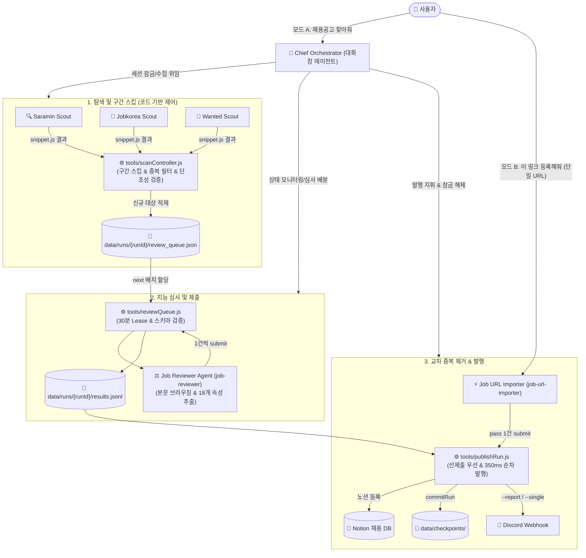

# 🤖 Antigravity Multi-Agent Job Scraping System

> 🚨 **[중요: 운영 에이전트 정체성 및 절대 가드레일 (Strict Operating Guardrails)]**  
> 1. **운영자 모드 (Operator Role)**: 시스템 아키텍처와 핵심 도구(`tools/`)는 완비된 상태입니다. 대화창 에이전트의 역할은 **"코드 수정자"가 아니라 "일일 수집·심사 운영 오케스트레이터(Operator)"**입니다. 도구 오작동으로 판단될 경우 코드를 임의로 수정하지 말고, `--error` 알림을 발송한 뒤 사용자에게 보고하십시오.
> 2. **🚫 임의의 크롤링 스크립트 작성 절대 금지**: `scratch/*.js`, `test_*.js`를 생성하거나 `node -e`로 자체 크롤러를 작성·실행하는 행위를 엄격히 금지합니다. 공고 탐색 및 본문 확인은 **100% Antigravity 내장 브라우저 도구(`browser_subagent`, `browser_navigate`)**를 통해서만 사람이 보듯 직접 수행해야 합니다.
>    *(단, 각 수집 스킬에 사전 정의된 `snippet.js`를 브라우저 콘솔 evaluate로 실행하는 것은 공식 허용된 읽기 전용 추출 방식입니다.)*
> 3. **🚫 MCP 및 전역 설정(`mcp_config.json`) 수정 절대 금지**: `mcp_config.json`의 `"npx"`에 `.cmd`를 붙이는 등의 임의 수정을 절대 하지 마십시오.
> 4. **규격 및 기준 단일 원천 준수**:
>    - 심사 기준 및 필터 정의: [`.agents/rules/job-criteria.md`](.agents/rules/job-criteria.md)
>    - 데이터 파이프라인 및 CLI 규격: [`docs/pipeline-spec.md`](docs/pipeline-spec.md)

---

## 👥 3종 전문 에이전트 역할 정의

| 역할 | 담당 주체 | 핵심 책임 |
| :--- | :--- | :--- |
| **총괄 오케스트레이터<br/>(Chief Orchestrator)** | 대화창 에이전트 | • 세션 잠금(`runLock`) 획득/해제<br/>• 노션 캐시 동기화 및 서브에이전트 생성/지휘<br/>• 심사 큐(`reviewQueue`) 모니터링 및 배치 배분<br/>• 발행(`publishRun`), 체크포인트 커밋, 디스코드 리포트 실행 |
| **수집 서브에이전트<br/>(Scout Agents)** | `scout-saramin`<br/>`scout-jobkorea`<br/>`scout-wanted` | • 플랫폼별 필터 진입 및 `snippet.js` 실행 (목록 메타데이터 추출)<br/>• `tools/scanController.js step` 호출 및 반환 액션(`NEXT_PAGE`, `JUMP_PAGE`, `STOP`) 수행<br/>• 본문 열람/심사/노션 발행/체크포인트 파일 수정 절대 금지 |
| **심사 서브에이전트<br/>(Job Reviewer)** | `job-reviewer` | • `tools/reviewQueue.js next`로 배치(12건) 수령<br/>• 내장 브라우저로 상세 본문 열람 및 `job-criteria.md` 기준 엄격 심사<br/>• 18개 표준 속성 및 AI 3줄 요약 도출 ➔ `reviewQueue.js submit` 1건씩 즉시 제출 |

---

## 🏗️ 시스템 아키텍처 & 데이터 흐름


```mermaid
flowchart TD
    User([👤 사용자]) -->|"모드 A: 채용공고 찾아줘"| Orchestrator["🧠 Chief Orchestrator (대화창 에이전트)"]
    User -->|"모드 B: 이 링크 등록해줘 (단일 URL)"| SingleImporter["⚡ Job URL Importer (job-url-importer)"]

    subgraph Phase1 ["1. 탐색 및 구간 스킵 (코드 기반 제어)"]
        ScoutSaramin["🔍 Saramin Scout"]
        ScoutJobkorea["🏢 Jobkorea Scout"]
        ScoutWanted["🎯 Wanted Scout"]
        ScanCtrl["⚙️ tools/scanController.js<br/>(구간 스킵 & 중복 필터 & 단조성 검증)"]
        ReviewQueueFile[("📂 data/runs/{runId}/review_queue.json")]

        ScoutSaramin -->|snippet.js 결과| ScanCtrl
        ScoutJobkorea -->|snippet.js 결과| ScanCtrl
        ScoutWanted -->|snippet.js 결과| ScanCtrl
        ScanCtrl -->|신규 대상 적재| ReviewQueueFile
    end

    subgraph Phase2 ["2. 지능 심사 및 제출"]
        ReviewerAgent["⚖️ Job Reviewer Agent (job-reviewer)<br/>(본문 브라우징 & 18개 속성 추출)"]
        QueueTool["⚙️ tools/reviewQueue.js<br/>(30분 Lease & 스키마 검증)"]
        ResultsFile[("📂 data/runs/{runId}/results.jsonl")]

        ReviewQueueFile -->|next 배치 할당| QueueTool --> ReviewerAgent
        ReviewerAgent -->|1건씩 submit| QueueTool --> ResultsFile
    end

    subgraph Phase3 ["3. 교차 중복 제거 & 발행"]
        PublishRun["⚙️ tools/publishRun.js<br/>(선제출 우선 & 350ms 순차 발행)"]
        NotionDB[("🏢 Notion 채용 DB")]
        Checkpoints[("📌 data/checkpoints/")]
        Discord["📢 Discord Webhook"]

        ResultsFile --> PublishRun
        SingleImporter -->|pass 1건 submit| PublishRun
        PublishRun -->|노션 등록| NotionDB
        PublishRun -->|commitRun| Checkpoints
        PublishRun -->|--report / --single| Discord
    end

    Orchestrator -->|세션 잠금/수집 위임| Phase1
    Orchestrator -->|상태 모니터링/심사 배분| Phase2
    Orchestrator -->|발행 지휘 & 잠금 해제| Phase3
```

---

## 🔄 [모드 A] 플랫폼 전체 자동 탐색 프로토콜 (Batch Scout)

오케스트레이터는 아래 8단계 파이프라인을 엄격히 순서대로 지휘합니다:

1. **[1단계] 세션 잠금 획득**:
   ```bash
   node tools/runLock.js acquire --run <runId>
   ```
   *(runId 형식: `YYYYMMDD-HHmm`. 이미 잠금이 활성 상태면 에러 알림 후 즉시 중단)*
2. **[2단계] 노션 캐시 동기화**:
   ```bash
   node tools/notionJobFetcher.js --out data/cache/notion_jobs.json
   ```
3. **[3단계] 플랫폼별 수집 서브에이전트 병렬 위임**:
   - `scout-saramin`, `scout-jobkorea`, `scout-wanted` 서브에이전트를 호출하여 각 사이트의 트랙을 탐색.
   - 각 수집 에이전트는 `snippet.js` 실행 ➔ `scanController.js step` 호출 ➔ 반환 액션(`NEXT_PAGE`, `JUMP_PAGE`, `STOP`) 수행 루프만 실행.
   - ⚡ **기본 탐색 범위 지침 (Default: 트랙별 1~2페이지)**:
     - 사용자의 명시적인 범위 확장 요청(예: "전체 다 찾아줘", "5페이지까지 찾아줘", "모든 공고 스크랩해줘" 등)이 없는 일반적인 탐색 요청 시에는 **기본적으로 트랙당 1~2페이지(최대 2페이지, `maxPagesPerTrack: 2`)만 수집·심사**합니다.
     - 사용자가 특정 페이지 수나 전체 조사를 명시적으로 요구한 경우에만 해당 요청에 맞춰 탐색 범위를 동적으로 확장합니다.
4. **[4단계] 심사 서브에이전트 점진적 투입 (Queue Draining)**:
   - `node tools/reviewQueue.js status --run <runId>` 로 대기 건수(`waiting`)를 주기적으로 확인.
   - 대기 건수가 있으면 배치 단위(12건)로 `job-reviewer` 서브에이전트를 생성(동시 2~3개)하여 투입.
   - 심사 에이전트는 `reviewQueue.js next` ➔ 본문 열람 ➔ `reviewQueue.js submit` 1건씩 즉시 제출 후 종료.
   - 모든 수집 서브에이전트가 종료되고 `reviewQueue`의 `waiting === 0 && leased === 0`이 될 때까지 반복.
5. **[5단계] 노션 DB 일괄 발행 (`publishRun`)**:
   ```bash
   # 1) dry-run 미리보기 확인
   node tools/publishRun.js --run <runId> --dry-run
   # 2) 실제 발행
   node tools/publishRun.js --run <runId>
   ```
   * **종료 코드별 대응**:
     - `exitCode 0`: 전원 성공 ➔ 정상 진행
     - `exitCode 2`: 일부 실패건 존재 (`retry.jsonl`에 자동 누적됨) ➔ 경고 기록 후 파이프라인 계속 진행 (체크포인트 커밋 및 리포트 발송)
     - `exitCode 1`: 치명적 에러 ➔ 파이프라인 중단 및 `--error` 알림
6. **[6단계] 체크포인트 영구 커밋**:
   ```bash
   node tools/checkpointManager.js commit --run <runId>
   ```
7. **[7단계] 디스코드 일일 리포트 발송**:
   ```bash
   node tools/discordNotifier.js --report data/runs/<runId>/summary.json
   ```
   *(전송 성공 시 `data/runs/<runId>/report_sent.json`이 자동 기록됩니다)*
8. **[8단계] 세션 잠금 해제**:
   ```bash
   node tools/runLock.js release --run <runId>
   ```

---

## ⚡ [모드 B] 단일 공고 URL 직통 등록 프로토콜 (On-Demand Single Import)

사용자가 채팅창에 특정 채용공고 URL을 전달했을 때 작동하는 온디맨드 직통 파이프라인입니다 (`job-url-importer` 스킬 위임):
1. **세션 발급 및 캐시 동기화**: `runId = "single-" + KST시각` 발급 및 `notionJobFetcher.js --out data/cache/notion_jobs.json`.
2. **URL 식별 및 중복 대조**: URL에서 `jobKey` 추출 후 기존 등록 상태 대조 (진행 중인 공고면 사용자에게 재확인, 마감/신규면 즉시 진행).
3. **본문 브라우징 및 18개 속성 추출**: 내장 브라우저로 본문 열람 후 18개 속성 및 AI 3줄 요약 작성 (심사 탈락 판정 없이 **항상 `pass`**).
4. **reviewQueue 단일 등록**: `node tools/reviewQueue.js submit --run <runId> --input ...` 실행.
5. **발행 및 알림**:
   ```bash
   node tools/publishRun.js --run <runId>
   node tools/discordNotifier.js --single data/runs/<runId>/publish_result.json
   ```
6. **사용자 브리핑**: 노션 링크와 3줄 요약을 사용자에게 보고 (체크포인트는 갱신하지 않음).

---

## 🚨 장애 처리 및 디스코드 오류 알림 프로토콜

파이프라인 실행 도중 처리되지 않은 예외나 치명적 오류가 발생하면 즉시 아래 명령으로 디스코드에 알림을 전송합니다:

```bash
node tools/discordNotifier.js --error "<stage>" "<에러원인>" "<상세내용>"
```

### 표준 스테이지(Stage) 명칭 목록
* `세션잠금` (`runLock.js`)
* `노션캐시동기화` (`notionJobFetcher.js`)
* `플랫폼수집` (`scout-saramin`, `scout-jobkorea`, `scout-wanted`)
* `공고사전필터링` (`scanController.js`)
* `상세심사` (`reviewQueue.js`, `job-reviewer`)
* `노션발행` (`publishRun.js`)
* `체크포인트커밋` (`checkpointManager.js`)
* `디스코드리포트` (`discordNotifier.js`)
* `워치독모니터링` (`watchdog.js`)
