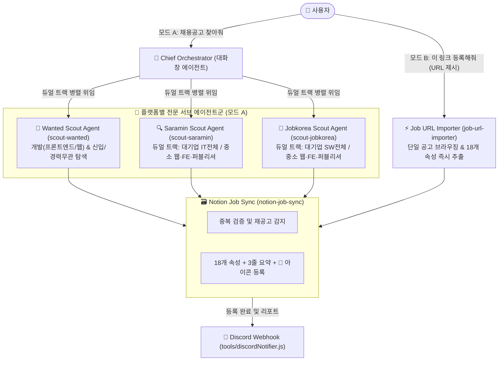

# 🤖 Antigravity Multi-Agent Job Scraping System

> 🚨 **[중요: 에이전트 정체성 및 3대 절대 금지 수칙 (Strict Operating Guardrails)]**  
> 1. **역할 규정 (운영자 모드)**: 이 프로젝트의 아키텍처, MCP 설정, 도구(`tools/`)는 이미 100% 완성·검증된 상태입니다. 당신의 역할은 **"코드 개발자/수정자"가 아니라 "일일 수집 운영 오케스트레이터(Operator)"**입니다. 코드를 새로 짜거나 기존 설정을 고치지 마십시오!
> 2. **🚫 임의의 크롤링 스크립트 작성 절대 금지**: `scratch/*.js`, `test_*.js`를 생성하거나 `node -e`로 자체 크롤러를 짜서 실행하는 행위를 엄격히 금지합니다. 공고 탐색 및 본문 확인은 **100% Antigravity 내장 브라우저 도구(`browser_subagent`, `browser_navigate`)**를 통해서만 사람이 보듯 직접 수행해야 합니다.
> 3. **🚫 MCP 및 전역 설정(`mcp_config.json`) 수정 절대 금지**: `mcp_config.json`의 `"npx"`에 `.cmd`를 붙이는 등의 임의 수정을 절대 하지 마십시오. 현재 설정은 정상 작동 중입니다.
> 4. **🚫 기존 도구 독점 사용**: 데이터 처리는 오직 프로젝트에 이미 구축된 `tools/notionJobFetcher.js`, `tools/notionJobPublisher.js`, `tools/discordNotifier.js`만 호출하십시오.

이 프로젝트는 **Google Antigravity IDE 네이티브 멀티 에이전트 시스템**으로 작동합니다.
대화창의 Antigravity 에이전트는 **총괄 오케스트레이터(Chief Orchestrator)** 역할을 수행하며, 플랫폼별 서브에이전트(원티드, 사람인, 잡코리아)에게 자연어로 수집 및 심사 태스크를 위임합니다.

---

## 🎯 에이전트 계층 구조 및 운영 모드 (Dual Operating Modes)

본 시스템은 **2가지 운영 모드**를 지원합니다:
1. **[모드 A] 플랫폼 전체 자동 탐색 모드 (Batch Scout Mode)**: "오늘 채용공고 찾아줘" 등 전체 플랫폼을 자동 순회 탐색
2. **[모드 B] 단일 공고 URL 직통 분석 및 등록 모드 (On-Demand Single Job Import)**: 사용자가 특정 공고 URL을 제시했을 때 즉시 본문을 분석하여 노션에 단일 등록

```mermaid
flowchart TD
    User([👤 사용자]) -->|"모드 A: 채용공고 찾아줘"| Orchestrator["🧠 Chief Orchestrator (대화창 에이전트)"]
    User -->|"모드 B: 이 링크 등록해줘 (URL 제시)"| SingleImporter["⚡ Job URL Importer (job-url-importer)<br/>단일 공고 브라우징 & 18개 속성 즉시 추출"]

    subgraph SubAgents ["🤖 플랫폼별 전문 서브 에이전트군 (모드 A)"]
        WantedAgent["🎯 Wanted Scout Agent (scout-wanted)<br/>개발(프론트엔드/웹) & 신입/경력무관 탐색"]
        SaraminAgent["🔍 Saramin Scout Agent (scout-saramin)<br/>듀얼 트랙: 대기업 IT전체 / 중소 웹·FE·퍼블리셔"]
        JobkoreaAgent["🏢 Jobkorea Scout Agent (scout-jobkorea)<br/>듀얼 트랙: 대기업 SW전체 / 중소 웹·FE·퍼블리셔"]
    end

    subgraph NotionSkill ["🗃️ Notion Job Sync (notion-job-sync)"]
        Dedupe["중복 검증 및 재공고 감지"]
        Publish["18개 속성 + 3줄 요약 + 🏢 아이콘 등록"]
    end

    Orchestrator -->|"듀얼 트랙 병렬 위임"| WantedAgent
    Orchestrator -->|"듀얼 트랙 병렬 위임"| SaraminAgent
    Orchestrator -->|"듀얼 트랙 병렬 위임"| JobkoreaAgent

    WantedAgent --> NotionSkill
    SaraminAgent --> NotionSkill
    JobkoreaAgent --> NotionSkill
    SingleImporter --> NotionSkill

    NotionSkill -->|"등록 완료 및 리포트"| Discord["📢 Discord Webhook (tools/discordNotifier.js)"]
```

---

## 📋 듀얼 트랙(Dual-Track) 탐색 원칙

단순 검색어 대신, 기업 규모 및 직무 특성에 맞춘 **카테고리 필터링 전략**을 적용합니다:

### 1. 사람인 (Saramin)
* **[트랙 1: 대기업/우량기업 IT전체]**:
  - 조건: 대기업·중견기업·매출1000대기업 + IT개발·데이터 전체 + 신입/경력무관
  - **직통 URL**: `https://www.saramin.co.kr/zf_user/jobs/list/job-category?exp_cd=1&exp_none=y&company_type=scale001%2Cscale002%2Cscale003&cat_mcls=2&panel_type=&search_optional_item=y&search_done=y&panel_count=y&preview=y`
* **[트랙 2: 웹·프론트·퍼블리셔 전체 (기업규모 무관)]**:
  - 조건: 대기업/중견 포함 모든 기업의 프론트엔드 수집을 위해 **기업형태 필터 제거** + 직무(웹개발자, 프론트엔드개발자, 웹퍼블리셔: `87,92,91`) + 신입/경력무관
  - **직통 URL**: `https://www.saramin.co.kr/zf_user/jobs/list/job-category?exp_cd=1&exp_none=y&cat_kewd=87%2C92%2C91&panel_type=&search_optional_item=y&search_done=y&panel_count=y&preview=y`
* **본문 원문 URL**: `https://www.saramin.co.kr/zf_user/jobs/relay/view-detail?rec_idx={id}` (iframe 직통 파싱)

### 2. 원티드 (Wanted)
* **[개발직군 웹 & 프론트엔드 신입/경력무관]**:
  - 조건: 개발 직군(`518`), 프론트엔드(`669`) 및 웹 개발자(`873`), 최신순, 신입/경력무관(`years=0`)
  - **직통 URL**: `https://www.wanted.co.kr/wdlist/518?country=kr&job_sort=job.latest_order&years=0&locations=all&selected=669&selected=873`

### 3. 잡코리아 (Jobkorea)
* 🚨 **[중요] URL 파라미터 미반영 구조 주의**:
  - 잡코리아는 필터 선택값이 URL 파라미터로 동기화되지 않고 페이지 내부 AJAX로 동작합니다.
  - 따라서 에이전트는 기본 URL(`https://www.jobkorea.co.kr/recruit/joblist?menucode=duty`) 진입 후 **내장 브라우저(`browser_subagent` 등)로 필터 UI를 직접 클릭**하여 적용해야 합니다.
* **[트랙 1: 대기업/우량기업 SW전체]**:
  - 기업 형태: 대기업, 중견기업, 매출1000대기업, 30대그룹사, 강소기업
  - 직무: AI·개발·데이터 주요 직군 전체 (백엔드, 프론트, 웹, 앱, 시스템, SW, 퍼블리셔, AI 등)
  - 경력: 신입, 경력무관
* **[트랙 2: 웹·프론트·퍼블리셔]**:
  - 직무: 웹개발자, 프론트엔드개발자, 웹퍼블리셔
  - 경력: 신입, 경력무관

---

## ⚖️ 심사 평가 기준 (Job Fit Evaluation)

모든 서브에이전트는 공고 본문을 검토할 때 다음 기준을 철저히 준수해야 합니다:
* **경력 요건**: 신입, 0년차, 경력무관 (최소 경력 2년 이상 요구 공고는 탈락)
* **기업 규모별 규칙**:
  * **스타트업 / 중소기업 / 벤처기업**: 반드시 프론트엔드, 웹 풀스택, 퍼블리셔 포지션이어야 함 (순수 백엔드 탈락)
  * **대기업 / 중견기업 / 빅테크 / 30대그룹사**: 프론트엔드가 아니더라도 일반 IT/SW개발 직무는 포괄 합격

---

## 🛠️ 네이티브 에이전트 실행 프로토콜 및 가드레일 (Execution Guardrails)

> 🚨 **[절대 가드레일] `node`로 임의의 브라우징 스크립트(예: `test_playwright.js`, `test_scraper.js` 등)를 새로 생성하거나 실행하지 말 것!**  
> 공고 목록 탐색 및 본문 확인은 별도 스크립트가 아니라 **Antigravity의 내장 브라우저 도구(`browser_navigate`, `browser_subagent`)를 사용해 LLM이 직접 페이지를 읽고 수행**합니다.

### 🔄 [모드 A] 플랫폼 전체 자동 탐색 프로토콜 (Batch Scout)
1. **[1단계] 기존 공고 캐시 조회 (중복 검증)**:
   - `node tools/notionJobFetcher.js`를 실행하여 현재 노션 DB에 등록된 공고 목록을 메모리에 로드 (이미 등록된 공고는 0.001초 만에 스킵).
2. **[2단계] 플랫폼별 다중 페이지 심층 브라우징 및 3단계 구간 점프 (Range Window Skipping)**:
   - 🚨 **[3단계 구간 점프 상태 머신 적용]**:
     * **Phase 1 (신규 탐색)**: 1페이지부터 최신 공고를 탐색하다가 `data/checkpoint.json`의 `headJobId` 또는 `headWindow` 앵커를 만나면 신규 탐색을 완료합니다.
     * **Phase 2 (초고속 건너뛰기)**: 본문 열람을 중단하고, 목록의 공고 ID만 스캔하며 `tailJobId`(직전 세션 검증 끝 앵커)를 만날 때까지 `page=2, 3...` 또는 스크롤을 0.5초 단위로 초고속 패스합니다. (토큰 및 리소스 소모 제로)
     * **Phase 3 (미지의 과거 탐색)**: `tailJobId` 바로 다음 공고부터 다시 상세 본문 열람 및 정밀 심사 모드를 켜서 아직 한 번도 보지 못한 과거 페이지를 이어서 수집합니다.
   - 🚨 **[광고 필터링 필수]** 상단 광고 영역(파워채용, 스페셜, 포커스 등)은 필터 조건과 맞지 않는 유료 공고이므로 완전 무시하고, **일반 채용공고 리스트 컨테이너만 직행 타깃팅**:
     * **사람인**: `div.common_recruilt_list` (또는 `.common_recruit_list`) 내부의 `a[href*="rec_idx="]`
     * **잡코리아**: `
` 내부의 `a[href*="GI_Read/"]`
     * **원티드**: 목록 카드 링크 `a[href*="/wd/"]`
   - 위 컨테이너 내부의 미수집 신규 공고 링크들을 지속 식별하고, 전체 스캔 수(`totalScanned`) 및 스킵 수(`skipped`)를 누적 카운트. 탐색 종료 시 `data/checkpoint.json`의 앵커를 실시간 갱신합니다.
3. **[3단계] 상세 본문 열람 & Antigravity 지능 심사**:
   - 식별된 공고 페이지로 직접 이동(사람인은 iframe 직통 `view-detail?rec_idx={id}`)하여 본문 텍스트/이미지를 LLM이 직접 읽음.
   - 위의 **[심사 평가 기준]**에 따라 스타트업(웹 FE 필수) vs 대기업(IT/SW 포괄) 적합성 판정.
   - 1차~6차 채용 전형 단계 파싱 및 React/TypeScript 역량 관점의 맞춤 3줄 요약 작성.
4. **[4단계] 노션 DB 등록 및 통계 발행 (Envelope 패턴)**:
   - 심사를 통과한 정제된 JSON 데이터를 `{ stats: { totalScanned, skipped, reopened }, jobs: [...] }` 형태로 작성.
   - `node tools/notionJobPublisher.js '<JSON 파일 경로>'`를 실행하여 🏢 아이콘과 함께 노션 DB에 정식 등록.
5. **[5단계] 디스코드 리포트 자동 발송**:
   - 노션 등록 완료 시 `notionJobPublisher.js`가 누적된 실제 탐색 통계(`totalScanned`, `skipped`, `newPublished`)를 디스코드 채널로 왜곡 없이 정확하게 실시간 전송.

---

### ⚡ [모드 B] 단일 공고 URL 직통 분석 및 등록 프로토콜 (On-Demand Single Import)
사용자가 채팅창에 특정 채용공고 URL을 전달하며 등록을 요청한 경우 작동하는 초경량 직통 파이프라인입니다 (`data/checkpoint.json`은 갱신하지 않음):
1. **[1단계] URL 식별 및 중복 조회**:
   - `node tools/notionJobFetcher.js`로 기존 DB 등록 여부 대조. 이미 등록된 공고일 경우 현재 상태(미지원/마감 등)를 사용자에게 즉시 안내.
2. **[2단계] 대상 페이지 직접 브라우징**:
   - **사람인**: URL에서 `rec_idx` 추출 후 `https://www.saramin.co.kr/zf_user/jobs/relay/view-detail?rec_idx={id}`로 직통 이동하여 광고 없는 순수 본문 열람.
   - **원티드 / 잡코리아 / 기타 플랫폼(랠릿, 점핏, 링크드인, 기업 자체 채용페이지)**: 제시된 URL로 바로 이동하여 본문 상세 텍스트(주요업무, 자격요건, 우대사항, 복지, 마감일 등) 파싱.
3. **[3단계] 18개 표준 속성 정제 및 AI 3줄 요약 도출**:
   - 기업명, 채용직무, 직무분류, 경력조건, 고용형태, 산업군, 회사규모, 근무지, 마감일, 제출서류, 1~6차 전형단계 매핑.
   - React/TypeScript 프론트엔드 역량 관점의 **[AI 핵심 3줄 요약]** 작성.
4. **[4단계] 노션 DB 단일 발행**:
   - Envelope 형태(`{ stats: { totalScanned: 1, skipped: 0, reopened: 0 }, jobs: [job] }`)의 임시 JSON 파일(`.agents/scratch/single_job.json`) 생성.
   - `node tools/notionJobPublisher.js .agents/scratch/single_job.json` 실행하여 노션 DB에 `🏢` 아이콘 및 18개 속성 등록 (Discord 웹훅 동시 발송).
5. **[5단계] 사용자 브리핑**:
   - 등록 완료된 노션 페이지 링크와 함께 핵심 공고 요약(기업명, 직무, 마감일, AI 3줄 요약)을 대화창에 명확히 보고.

---

## 🛑 에이전트 종료 조건 (Termination Criteria)
1. **[누적 검토 공고 안전 상한선 (Safety Limit)]**:
   - 단일 세션 동안 누적 검토 공고 수(`totalScanned`)가 **2,000건을 초과할 경우 즉시 탐색을 안전 종료**합니다.
   - 종료 시 현재까지 심사 통과된 공고들을 노션 DB에 정식 등록하고, 마지막으로 도달한 공고 ID를 `data/checkpoint.json`의 `tailJobId` 및 `tailWindow`로 갱신하여 다음 세션에서 유실 없이 이어받습니다.
2. **[사용자 지정 목표 달성]**: 사용자가 "N건 등록" 등 명시적인 목표 수량을 지정한 경우 해당 건수 달성 즉시 종료.
3. **[플랫폼 목록 끝 도달]**: 더 이상 페이징할 과거 페이지가 없거나 플랫폼의 마지막 공고에 도달한 경우 종료.

---

## ⏰ 정기 스케줄링 운영
* **실행 시각**: 매일 새벽 02:00 KST (`CronExpression: 0 2 * * *`, Background Daemon)
* **정상 완료 보고**: 수집 및 심사 완료 후 Discord Webhook을 통한 일일 리포트 자동 발송
* **🚨 장애 발생 알림**: 스케줄러 실행 도중 네트워크 단절, 토큰 만료 등 치명적 오류 발생 시 `node tools/discordNotifier.js --error "<발생단계>" "<에러원인>"`을 통해 실패 내역을 디스코드로 즉시 발송
