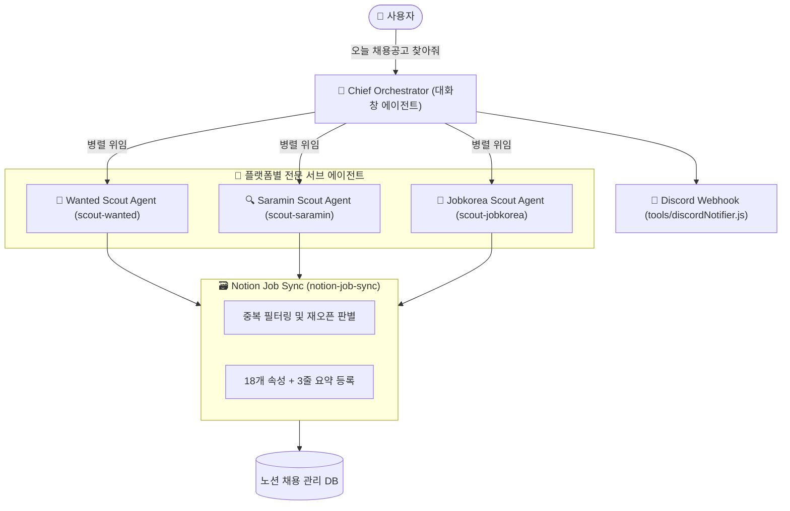

# 🤖 Antigravity Native Multi-Agent Job Scraping System

> **Google Antigravity IDE** 대화창의 메인 오케스트레이터가 플랫폼별 전문 서브에이전트(원티드, 사람인, 잡코리아)에게 자연어로 수집 및 심사를 위임하고, Playwright & Notion MCP를 활용해 노션 데이터베이스에 규격화된 공고를 자동 등록하는 순수 AI-First 멀티 에이전트 시스템

---

## 📌 시스템 개요

본 프로젝트는 고정된 크롤러 스크립트가 아닌, **Antigravity의 지능형 에이전트 생태계(`.agents/` Skills, Rules, Sub-Agents)**를 기반으로 작동합니다.

* **🧠 Chief Orchestrator (Antigravity Main Agent)**: 사용자의 자연어 명령을 수신하여 플랫폼별 탐색 전략을 세우고 서브에이전트를 지휘합니다.
* **🎯 전문 서브에이전트군 (Platform Scouts)**:
  * [Wanted Scout Sub-Agent](.agents/skills/scout-wanted/SKILL.md): 원티드 신입/경력무관 프론트엔드·웹개발 탐색 및 JD 정밀 심사
  * [Saramin Scout Sub-Agent](.agents/skills/scout-saramin/SKILL.md): 사람인 듀얼 트랙(대기업 IT전체 / 중소 웹·FE) 탐색 및 본문 판독
  * [Jobkorea Scout Sub-Agent](.agents/skills/scout-jobkorea/SKILL.md): 잡코리아 듀얼 트랙(대기업 SW / 중소 웹·FE) 탐색 및 요강 심사
* **🗃️ Notion Job Sync**:
  * [Notion Job Sync Skill](.agents/skills/notion-job-sync/SKILL.md): 18개 표준 메타데이터 속성, 🏢 아이콘, AI 3줄 요약 콜아웃 블록, 마감 후 재오픈 감지 로직 적용
* **📢 Discord 알림**:
  * `tools/discordNotifier.js`: 일일 수집 및 심사 통계를 디스코드 채널로 브리핑

---

## 🏗️ 아키텍처 다이어그램



---

## 📁 프로젝트 디렉토리 구조

```text
.
├── .agents/
│   ├── rules/
│   │   └── orchestration-protocol.md # 오케스트레이터 및 서브에이전트 행동 지침
│   └── skills/
│       ├── scout-wanted/SKILL.md      # 원티드 채용공고 전문 탐색 스킬
│       ├── scout-saramin/SKILL.md     # 사람인 채용공고 전문 탐색 스킬
│       ├── scout-jobkorea/SKILL.md    # 잡코리아 채용공고 전문 탐색 스킬
│       └── notion-job-sync/SKILL.md   # 노션 DB 동기화 및 18개 속성 규격 스킬
├── AGENTS.md                          # Antigravity 에이전트 시스템 전체 명세
├── tools/
│   ├── discordNotifier.js             # 디스코드 일일 리포트 발송 도구
│   └── notionJobPublisher.js          # 노션 DB 18개 속성 규격 발행 도구
├── docs/                              # 아키텍처 상세 설계 문서군
├── .env                               # Notion DB ID, Discord Webhook 등 설정
└── package.json
```

---

## 💬 사용 방법

채팅창에서 Antigravity에게 다음과 같이 자연어로 요청하면 파이프라인이 가동됩니다:

> 👤 **사용자**: *"채용공고 탐색해서 심사하고 노션에 등록해줘."*
>
> 🧠 **Antigravity (Orchestrator)**:
> 1. 노션 DB 기존 공고 캐시 확인 (중복 공고 필터링)
> 2. 플랫폼별(사람인, 잡코리아, 원티드) 전문 서브에이전트를 기동하여 듀얼 트랙 신규 공고 탐색
> 3. 상세 JD를 읽고 자격요건, 1~6차 전형절차, React/TS 지원 적합도 심사
> 4. 심사 통과 건을 노션 DB에 🏢 아이콘 및 18개 속성과 함께 등록
> 5. 최종 결과 브리핑 및 디스코드 리포트 자동 발송
