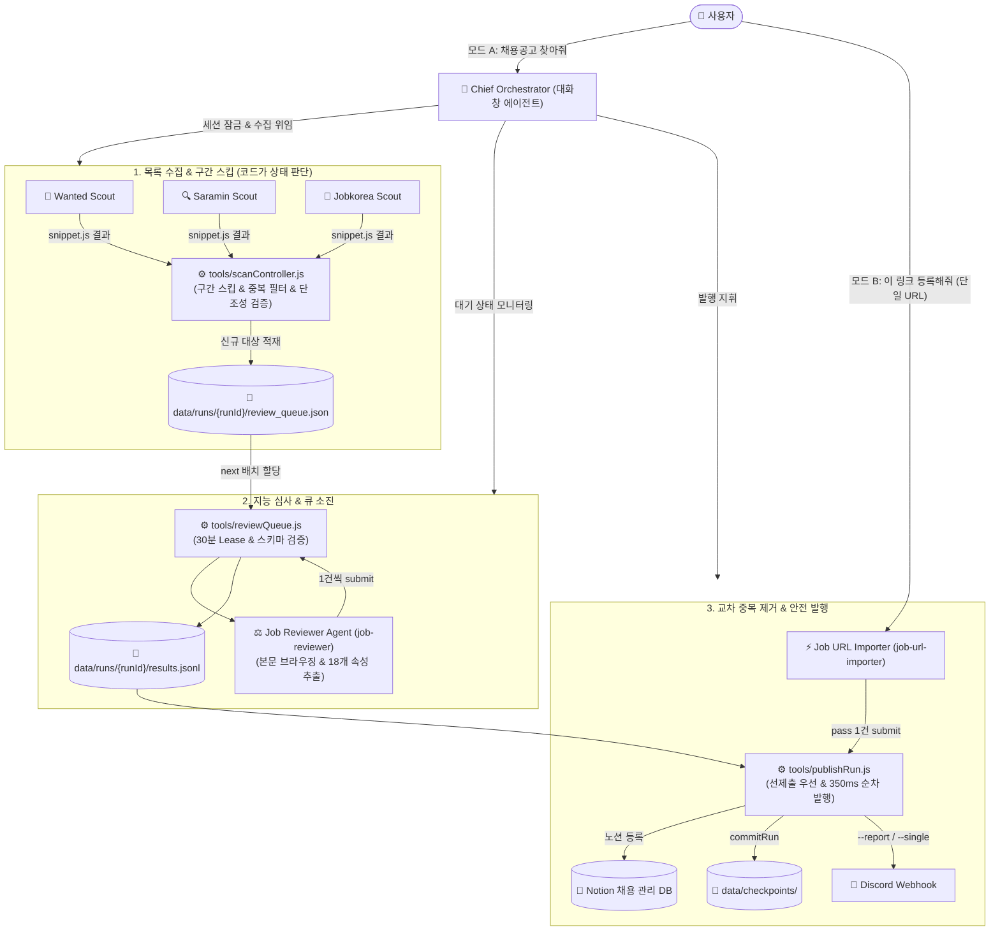

# 🤖 Antigravity Native Multi-Agent Job Scraping System

> **Google Antigravity IDE** 기반의 지능형 멀티 에이전트 채용공고 수집 시스템입니다.  
> 대화창 에이전트(Orchestrator)가 플랫폼별 수집 서브에이전트(`scout-*`)와 정밀 심사 서브에이전트(`job-reviewer`)를 유기적으로 지휘하며, **판단·중복검증·구간점프·발행은 전용 Node.js 도구가 코드로 전담하고 LLM은 브라우징과 지능 심사에 집중**합니다.

---

## 🏗️ 시스템 아키텍처 다이어그램


```mermaid
flowchart TD
    User([👤 사용자]) -->|"모드 A: 채용공고 찾아줘"| Orchestrator["🧠 Chief Orchestrator (대화창 에이전트)"]
    User -->|"모드 B: 이 링크 등록해줘 (단일 URL)"| Importer["⚡ Job URL Importer (job-url-importer)"]

    subgraph Phase1 ["1. 목록 수집 & 구간 스킵 (코드가 상태 판단)"]
        ScoutWanted["🎯 Wanted Scout"]
        ScoutSaramin["🔍 Saramin Scout"]
        ScoutJobkorea["🏢 Jobkorea Scout"]
        ScanCtrl["⚙️ tools/scanController.js<br/>(구간 스킵 & 중복 필터 & 단조성 검증)"]
        ReviewQueue[("📂 data/runs/{runId}/review_queue.json")]

        ScoutWanted -->|snippet.js 결과| ScanCtrl
        ScoutSaramin -->|snippet.js 결과| ScanCtrl
        ScoutJobkorea -->|snippet.js 결과| ScanCtrl
        ScanCtrl -->|신규 대상 적재| ReviewQueue
    end

    subgraph Phase2 ["2. 지능 심사 & 큐 소진"]
        ReviewerAgent["⚖️ Job Reviewer Agent (job-reviewer)<br/>(본문 브라우징 & 18개 속성 추출)"]
        ReviewQueueTool["⚙️ tools/reviewQueue.js<br/>(30분 Lease & 스키마 검증)"]
        ResultsFile[("📂 data/runs/{runId}/results.jsonl")]

        ReviewQueue -->|next 배치 할당| ReviewQueueTool --> ReviewerAgent
        ReviewerAgent -->|1건씩 submit| ReviewQueueTool --> ResultsFile
    end

    subgraph Phase3 ["3. 교차 중복 제거 & 안전 발행"]
        PublishRun["⚙️ tools/publishRun.js<br/>(선제출 우선 & 350ms 순차 발행)"]
        NotionDB[("🏢 Notion 채용 관리 DB")]
        Checkpoints[("📌 data/checkpoints/")]
        Discord["📢 Discord Webhook"]

        ResultsFile --> PublishRun
        Importer -->|pass 1건 submit| PublishRun
        PublishRun -->|노션 등록| NotionDB
        PublishRun -->|commitRun| Checkpoints
        PublishRun -->|--report / --single| Discord
    end

    Orchestrator -->|세션 잠금 & 수집 위임| Phase1
    Orchestrator -->|대기 상태 모니터링| Phase2
    Orchestrator -->|발행 지휘| Phase3
```

---

## 📁 프로젝트 디렉토리 구조

```text
.
├── .agents/
│   ├── rules/
│   │   ├── job-criteria.md            # 심사 기준·트랙·필터 값의 유일한 원천
│   │   └── orchestration-protocol.md  # 오케스트레이션 행동 지침 요약
│   └── skills/
│       ├── scout-wanted/SKILL.md      # 원티드 목록 수집 스킬
│       ├── scout-saramin/SKILL.md     # 사람인 목록 수집 스킬
│       ├── scout-jobkorea/SKILL.md    # 잡코리아 UI 필터 설정 및 목록 수집 스킬
│       ├── job-reviewer/SKILL.md      # 본문 정밀 심사 및 18개 속성 추출 스킬
│       ├── job-url-importer/SKILL.md  # 단일 채용공고 즉시 임포트 스킬
│       └── notion-job-sync/SKILL.md   # 노션 18개 표준 속성 규격 참조 스킬
├── tools/
│   ├── runLock.js                     # 실행 세션 상호 배제 잠금 도구 (6시간 만료 회수)
│   ├── notionJobFetcher.js            # 노션 DB 기존 공고 조회 및 로컬 캐시 생성
│   ├── jobKeys.js                     # 공고 식별 키 추출, URL 정규화, 문자열 유사도
│   ├── registry.js                    # 누적 공고 레지스트리 영구 관리 (원자적 쓰기)
│   ├── jobFilter.js                   # 4단계 사전 필터링 (스킵, 재오픈, 의심 중복, 신규)
│   ├── scanController.js              # 3단계 구간 점프(Range Skip) 상태 머신 제어
│   ├── reviewQueue.js                 # 심사 큐 관리 (30분 lease, 스키마 검증, submit)
│   ├── publishRun.js                  # 교차 중복 제거 및 노션 DB 순차 발행 (350ms 제한)
│   ├── checkpointManager.js           # 사이트/트랙별 체크포인트 영구 반영 (commit)
│   ├── discordNotifier.js             # 디스코드 일일 리포트 / 단일 등록 / 장애 알림 발송
│   ├── watchdog.js                    # 일일 수집 완료 여부 자동 감시 도구
│   └── logger.js                      # 표준 KST 타임스탬프 로거
├── data/                              # 캐시, 레지스트리, 체크포인트, 실행 결과 폴더
├── config/
│   ├── pipeline.json                  # 파이프라인 파라미터 및 트랙별 기대 필터 설정
│   └── company-aliases.json           # 기업명 정규화 별칭 사전
├── docs/                              # 아키텍처 상세 설계 문서군
│   └── pipeline-spec.md               # 데이터·CLI 규격의 유일한 원천
├── AGENTS.md                          # Antigravity 에이전트 시스템 전체 운영 명세
├── .env                               # Notion Database ID, Secret, Discord Webhook 등 설정
└── package.json
```

---

## 🛠️ 핵심 도구 CLI 레퍼런스

| 도구 | 주요 명령 예시 | 설명 |
| :--- | :--- | :--- |
| `runLock.js` | `node tools/runLock.js acquire --run <runId>`<br/>`node tools/runLock.js release --run <runId>` | 세션 중복 실행 방지 잠금 획득 및 해제 |
| `notionJobFetcher.js` | `node tools/notionJobFetcher.js --out data/cache/notion_jobs.json` | 노션 DB 최신 공고 목록 조회 및 캐시 저장 |
| `scanController.js` | `node tools/scanController.js step --run <runId> --site <site> --track <track> --page <n> --input <path>` | 스니펫 결과를 바탕으로 다음 액션(`NEXT_PAGE`, `JUMP_PAGE`, `STOP`) 결정 |
| `reviewQueue.js` | `node tools/reviewQueue.js status --run <runId>`<br/>`node tools/reviewQueue.js next --run <runId>`<br/>`node tools/reviewQueue.js submit --run <runId> --input <path>` | 심사 큐 상태 확인, 배치 할당(12건), 결과 제출 |
| `publishRun.js` | `node tools/publishRun.js --run <runId> --dry-run`<br/>`node tools/publishRun.js --run <runId>` | 통과 공고 교차 중복 제거 후 노션 DB 순차 등록 (350ms 대기) |
| `checkpointManager.js` | `node tools/checkpointManager.js commit --run <runId>` | 정상 발행 완료 후 탐색 체크포인트 반영 |
| `discordNotifier.js` | `node tools/discordNotifier.js --report data/runs/<runId>/summary.json`<br/>`node tools/discordNotifier.js --single <result.json>`<br/>`node tools/discordNotifier.js --error "<stage>" "<reason>" "<detail>"` | 디스코드 일일 리포트, 단일 등록 알림, 장애 알림 발송 |
| `watchdog.js` | `node tools/watchdog.js` | 최근 수집 세션 완료 보고 누락 여부 검사 |

---

## 💬 실행 방법 (2가지 운영 모드)

### 1. 🔄 플랫폼 전체 자동 탐색 모드 (Batch Scout)
채용공고 사이트 전체를 자동으로 탐색하여 최신 공고를 일괄 수집·심사·등록할 때 사용합니다:

> 👤 **사용자**: *"채용공고 찾아줘"*
>
> 🧠 **Antigravity (Chief Orchestrator)**:
> 1. `runLock` 잠금 획득 및 최신 노션 DB 캐시 동기화
> 2. 플랫폼별 수집 서브에이전트(`scout-saramin`, `scout-jobkorea`, `scout-wanted`) 병렬 기동
> 3. 심사 큐(`reviewQueue`) 대기 건수 모니터링 후 심사 서브에이전트(`job-reviewer`) 투입 (배치당 12건 심사 및 즉시 submit)
> 4. `publishRun`을 통한 교차 중복 제거 및 노션 DB 순차 등록
> 5. `checkpointManager commit`을 통한 체크포인트 영구 저장
> 6. `discordNotifier --report`를 통한 디스코드 결과 리포트 발송 및 `runLock release`

---

### 2. ⚡ 단일 공고 URL 직통 등록 모드 (On-Demand Single Import)
원하는 채용공고 링크를 직접 전달하여 해당 공고만 즉시 등록하고 싶을 때 사용합니다:

> 👤 **사용자**: *"이 공고 노션에 등록해줘: https://www.saramin.co.kr/zf_user/jobs/relay/view?rec_idx=55201338"*  
> *(원티드, 잡코리아, 사람인, 랠릿, 링크드인, 기업 자체 ATS 링크 등 지원)*
>
> 🧠 **Antigravity (Job URL Importer)**:
> 1. 내장 브라우저로 해당 공고 페이지 열람 (필터 심사 없이 사용자 지정 등록)
> 2. 18개 표준 속성 및 AI 3줄 요약 추출 후 `verdict: "pass"`로 제출
> 3. `publishRun`으로 노션 DB 발행 및 디스코드 단일 알림 전송
> 4. 생성된 노션 링크와 핵심 3줄 요약 보고 (탐색 체크포인트는 건드리지 않음)
