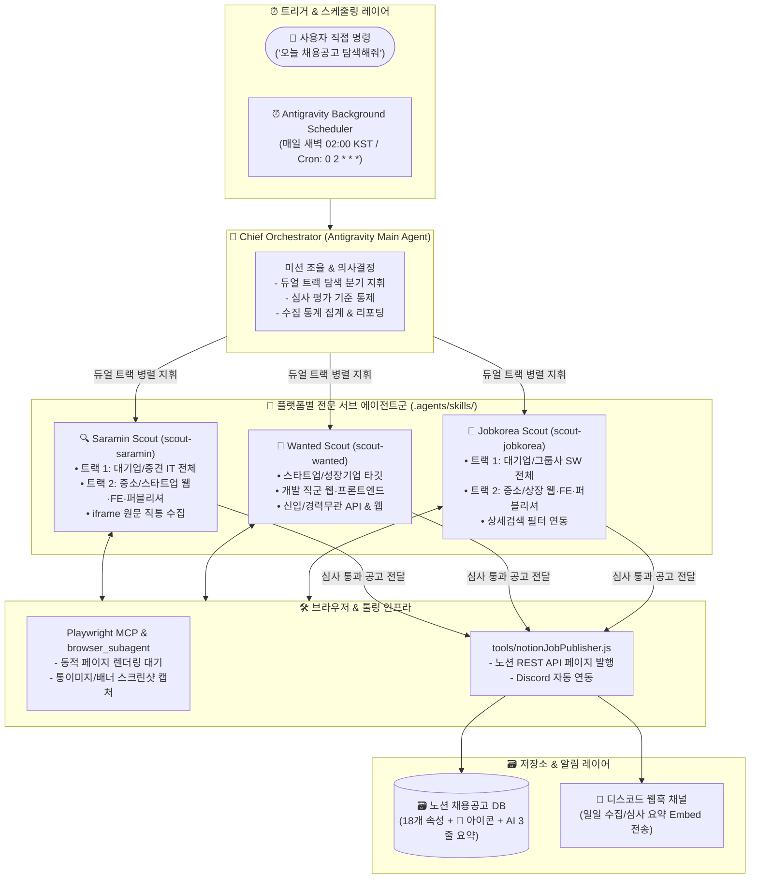

# 2. 시스템 아키텍처 (System Architecture)

## 2.1 전체 시스템 구조도

본 시스템은 **Google Antigravity IDE 네이티브 멀티 에이전트 시스템**으로 동작합니다. 대화창의 Antigravity 메인 에이전트가 **총괄 오케스트레이터(Chief Orchestrator)** 역할을 수행하며, 플랫폼별 서브에이전트 스킬과 브라우저 도구(`playwright MCP`, `browser_subagent`), 노션 동기화 스킬(`notion-job-sync`)을 유기적으로 지휘합니다.

---

## 2.2 단계별 데이터 파이프라인 (Data Flow Lifecycle)

### Phase 1: 스케줄 트리거 및 기존 공고 캐시 대조
1. 매일 새벽 02:00 정기 데몬 또는 사용자 요청에 의해 파이프라인 가동.
2. `notion-job-sync` 스킬을 통해 노션 DB의 기존 등록 공고 URL 및 마감 상태를 조회하여 인메모리 캐시 구축.
3. 활성 상태인 기존 공고는 즉시 스킵(0.001초 Fast-forward)하고, 마감 후 재오픈된 공고는 재수집 대상으로 판별.

### Phase 2: 플랫폼별 듀얼 트랙(Dual-Track) 탐색
1. **사람인 ([scout-saramin](../.agents/skills/scout-saramin/SKILL.md))**:
   - 트랙 1 (대기업/중견): `cat_mcls=2` & `company_type=scale001,scale002,scale003` & 신입/경력무관
   - 트랙 2 (중소/스타트업): `cat_cd=87,92,91` & `company_type=scale004,scale005` & 신입/경력무관
   - 본문 원문은 `view-detail?rec_idx={id}` iframe 직통으로 접근하여 누락 없이 수집.
2. **잡코리아 ([scout-jobkorea](../.agents/skills/scout-jobkorea/SKILL.md))**:
   - 트랙 1 (대기업/그룹사): `cotype=1,2,3,4,5` & 주요 개발 직군 전체 & `career=1,8`
   - 트랙 2 (중소/상장): `cotype=15,7,11,12` & 웹개발/프론트/퍼블리셔 & `career=1,8`
3. **원티드 ([scout-wanted](../.agents/skills/scout-wanted/SKILL.md))**:
   - 개발 직군(`518`), 웹개발(`873`), 프론트엔드(`669`), 풀스택(`872`) & `years=0`

### Phase 3: 지능형 심사 및 전형 분해
* **신입 적합성**: 신입/0년차/경력무관 집중 (최소 2년 이상 요구 시 탈락).
* **기업 규모별 규칙**:
  - 스타트업/중소기업: 웹 프론트엔드, 웹 풀스택, 퍼블리셔 필수 (순수 백엔드 탈락).
  - 대기업/빅테크: 일반 IT/SW개발 직무 포괄 합격.
* **본문 구조화**: 1차~6차 채용 전형 단계 추출 및 React/TS 지원 포인트 중심 AI 3줄 요약 작성.

### Phase 4: 노션 등록 및 디스코드 리포팅
1. 심사를 통과한 정제 데이터를 [tools/notionJobPublisher.js](../tools/notionJobPublisher.js)에 전달.
2. 노션 DB에 18개 정밀 속성과 함께 `🏢` 아이콘 및 블루 콜아웃 블록으로 페이지 등록 (`매력도`는 공란 유지).
3. [tools/discordNotifier.js](../tools/discordNotifier.js)를 통해 당일 수집/심사 통계 요약 Embed 리포트를 디스코드 채널로 실시간 전송.

---

## 2.3 핵심 기술 스택 및 환경

* **오케스트레이션 엔진**: Google Antigravity IDE Native Multi-Agent Framework
* **스킬 시스템**: `.agents/skills/` (YAML Frontmatter 기반 에이전트 행동 지침)
* **브라우저 제어**: Playwright MCP 서버 + Antigravity `browser_subagent`
* **노션 연동**: Notion MCP 및 [tools/notionJobPublisher.js](../tools/notionJobPublisher.js)
* **알림 연동**: Discord Webhook (`tools/discordNotifier.js`)
* **스케줄러**: Antigravity Background Recurring Daemon (`0 2 * * *`)
