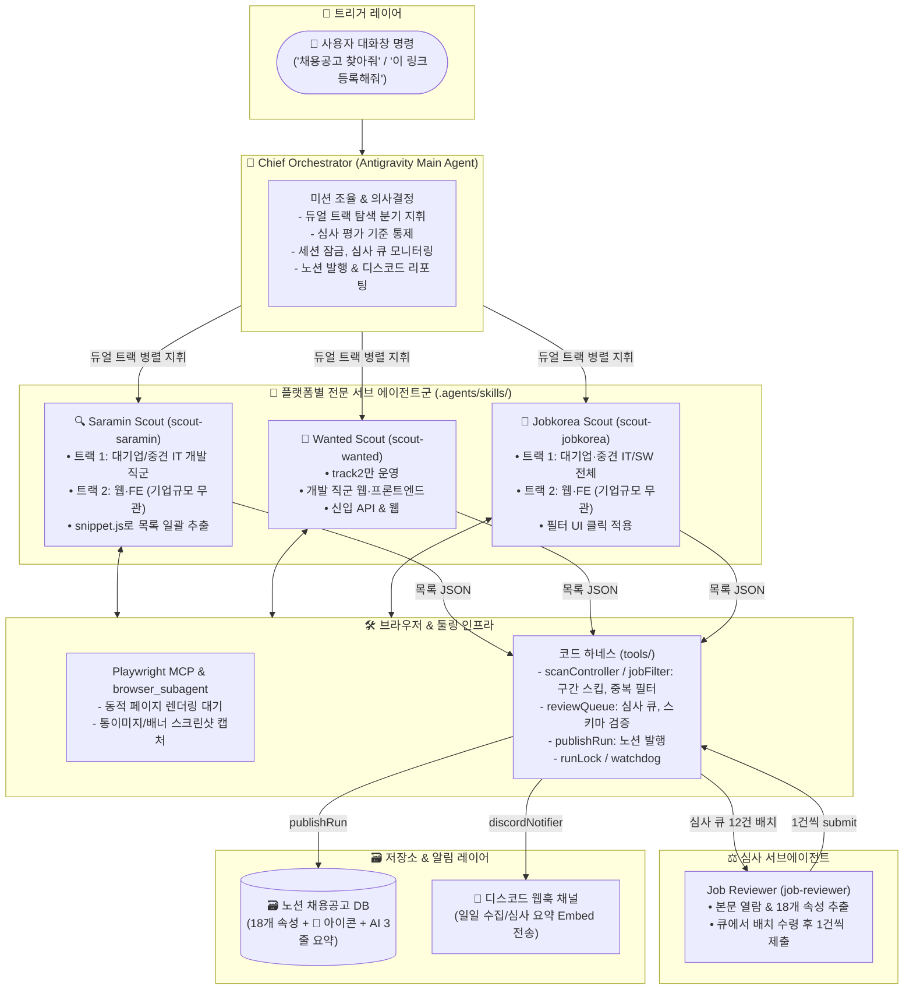

# 2. 시스템 아키텍처 (System Architecture)

## 2.1 전체 시스템 구조도

본 시스템은 **Google Antigravity IDE 네이티브 멀티 에이전트 시스템**으로 동작합니다. 대화창의 Antigravity 메인 에이전트가 **총괄 오케스트레이터(Chief Orchestrator)** 역할을 수행하며, 플랫폼별 서브에이전트 스킬과 브라우저 도구(`playwright MCP`, `browser_subagent`), 노션 동기화 스킬(`notion-job-sync`)을 유기적으로 지휘합니다.

```mermaid
flowchart TD
    subgraph TriggerLayer ["👤 트리거 레이어"]
        UserCmd(["👤 사용자 대화창 명령<br/>('채용공고 찾아줘' / '이 링크 등록해줘')"])
    end

    subgraph MasterOrchestrator ["🧠 Chief Orchestrator (Antigravity Main Agent)"]
        OrchMind["미션 조율 & 의사결정<br/>- 듀얼 트랙 탐색 분기 지휘<br/>- 심사 평가 기준 통제<br/>- 세션 잠금, 심사 큐 모니터링<br/>- 노션 발행 & 디스코드 리포팅"]
    end

    subgraph SubAgentLayer ["🤖 플랫폼별 전문 서브 에이전트군 (.agents/skills/)"]
        SaraminAgent["🔍 Saramin Scout (scout-saramin)<br/>• 트랙 1: 대기업/중견 IT 개발 직군<br/>• 트랙 2: 웹·FE (기업규모 무관)<br/>• snippet.js로 목록 일괄 추출"]
        WantedAgent["🎯 Wanted Scout (scout-wanted)<br/>• track2만 운영<br/>• 개발 직군 웹·프론트엔드<br/>• 신입 API & 웹"]
        JobkoreaAgent["🏢 Jobkorea Scout (scout-jobkorea)<br/>• 트랙 1: 대기업·중견 IT/SW 전체<br/>• 트랙 2: 웹·FE (기업규모 무관)<br/>• 필터 UI 클릭 적용"]
    end

    subgraph ReviewLayer ["⚖️ 심사 서브에이전트"]
        ReviewerAgent["Job Reviewer (job-reviewer)<br/>• 본문 열람 & 18개 속성 추출<br/>• 큐에서 배치 수령 후 1건씩 제출"]
    end

    subgraph ToolingLayer ["🛠️ 브라우저 & 툴링 인프라"]
        BrowserTools["Playwright MCP & browser_subagent<br/>- 동적 페이지 렌더링 대기<br/>- 통이미지/배너 스크린샷 캡처"]
        HarnessTools["코드 하네스 (tools/)<br/>- scanController / jobFilter: 구간 스킵, 중복 필터<br/>- reviewQueue: 심사 큐, 스키마 검증<br/>- publishRun: 노션 발행<br/>- runLock / watchdog"]
    end

    subgraph StorageAlert ["🗃️ 저장소 & 알림 레이어"]
        NotionDB[("🗃️ 노션 채용공고 DB<br/>(18개 속성 + 🏢 아이콘 + AI 3줄 요약)")]
        DiscordAlert["📢 디스코드 웹훅 채널<br/>(일일 수집/심사 요약 Embed 전송)"]
    end

    TriggerLayer --> MasterOrchestrator
    MasterOrchestrator -->|"듀얼 트랙 병렬 지휘"| SaraminAgent & WantedAgent & JobkoreaAgent
    SaraminAgent & WantedAgent & JobkoreaAgent <--> ToolingLayer
    
    SaraminAgent & WantedAgent & JobkoreaAgent -->|"목록 JSON"| HarnessTools
    HarnessTools -->|"심사 큐 12건 배치"| ReviewerAgent
    ReviewerAgent -->|"1건씩 submit"| HarnessTools
    HarnessTools -->|"publishRun"| NotionDB
    HarnessTools -->|"discordNotifier"| DiscordAlert
```

---

## 2.2 단계별 데이터 파이프라인 (Data Flow Lifecycle)

### Phase 1: 세션 시작 및 기존 공고 캐시 대조
1. 사용자의 대화창 명령에 의해 세션 잠금 획득 및 파이프라인 가동.
2. `notionJobFetcher`를 통해 노션 DB의 기존 등록 공고(`공고키`, URL, 마감 상태)를 조회하여 캐시 구축.
3. 활성 상태인 기존 공고는 목록 단계(`jobFilter`)에서 스킵하고, 마감 후 재오픈된 공고는 재수집 대상으로 판별.

### Phase 2: 플랫폼별 트랙 탐색
트랙 정의와 플랫폼별 필터 설정값(사람인·원티드 URL, 잡코리아 UI 클릭 항목)은 **[job-criteria.md](../.agents/rules/job-criteria.md)** 를 따릅니다. 운영 트랙: 사람인 track1+track2, 잡코리아 track1+track2, 원티드 track2만.
1. **사람인 ([scout-saramin](../.agents/skills/scout-saramin/SKILL.md))**: URL 파라미터 방식. 본문 원문은 `view-detail?rec_idx={id}` iframe 직통으로 접근하여 누락 없이 수집.
2. **잡코리아 ([scout-jobkorea](../.agents/skills/scout-jobkorea/SKILL.md))**: URL 파라미터가 동작하지 않아 필터 UI 클릭으로만 적용.
3. **원티드 ([scout-wanted](../.agents/skills/scout-wanted/SKILL.md))**: track2 전용.

### Phase 3: 지능형 심사 및 전형 분해
* **심사 기준**: 경력·퍼블리셔·트랙별 직무 기준과 탈락 사유 코드는 [job-criteria.md](../.agents/rules/job-criteria.md) 참조.
* **본문 구조화**: 1차~6차 채용 전형 단계 추출 및 React/TS 지원 포인트 중심 AI 3줄 요약 작성.

### Phase 4: 노션 등록 및 디스코드 리포팅
1. 오케스트레이터가 `results.jsonl`의 심사 통과 건을 [tools/publishRun.js](../tools/publishRun.js)로 발행 (교차 플랫폼 중복 제거 후 순차 등록).
2. 노션 DB에 18개 정밀 속성과 함께 `🏢` 아이콘 및 블루 콜아웃 블록으로 페이지 등록 (`매력도`는 공란 유지).
3. [tools/discordNotifier.js](../tools/discordNotifier.js)를 통해 당일 수집/심사 통계 요약 Embed 리포트를 디스코드 채널로 실시간 전송.

---

## 2.3 핵심 기술 스택 및 환경

* **오케스트레이션 엔진**: Google Antigravity IDE Native Multi-Agent Framework
* **스킬 시스템**: `.agents/skills/` (YAML Frontmatter 기반 에이전트 행동 지침)
* **브라우저 제어**: Playwright MCP 서버 + Antigravity `browser_subagent`
* **노션 연동**: Notion MCP 및 [tools/publishRun.js](../tools/publishRun.js) (내부적으로 [tools/notionJobPublisher.js](../tools/notionJobPublisher.js) 사용)
* **알림 연동**: Discord Webhook (`tools/discordNotifier.js`)
* **실행 방식**: 대화창 기반 온디맨드(On-Demand) 자연어 오케스트레이션
