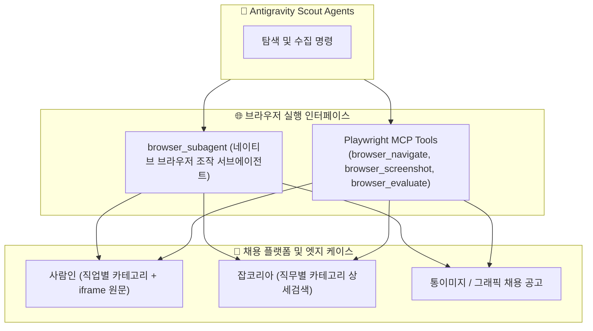

# 4. 브라우징 및 MCP 연동 전략 (Browsing & MCP Strategy)

본 문서는 Antigravity 에이전트 환경에서 Playwright MCP 서버 및 `browser_subagent`를 활용하여 채용 플랫폼의 동적 요소를 안정적으로 탐색하고, 통이미지 공고를 시각적으로 판독하는 전략을 기술합니다.

---

## 4.1 브라우저 제어 계층 및 도구

---

## 4.2 플랫폼별 특화 브라우징 전략

### 1. 사람인 (Saramin) iframe 원문 직통 전략
* **문제점**: 사람인 상세 페이지는 요강 본문이 별도의 iframe으로 분리되어 있어 메인 페이지 텍스트만 스크랩하면 자격 요건과 우대 사항이 누락됨.
* **해결책**:
  * 공고 ID(`rec_idx`)를 추출한 후, 본문 원문 전용 직통 URL로 바로 진입합니다:
    `https://www.saramin.co.kr/zf_user/jobs/relay/view-detail?rec_idx={id}`
  * iframe 내부 텍스트 전체와 전형 단계가 단일 DOM으로 온전히 노출되어 100% 무손실 수집 가능.

### 2. 잡코리아 (Jobkorea) 직무별 채용 URL 및 DOM 인터랙션
* **문제점**: 단순 키워드 검색(`Search/?stext=...`) 시 상단 파워링크 및 무관한 홍보 공고가 다수 섞여 나옴.
* **해결책**:
  * `recruit/joblist?menucode=duty` 엔드포인트에 직무 코드(`duty=1000229,1000230,...`), 경력 코드(`career=1,8`), 기업 형태 코드(`cotype=1,2,3,4,5` 등)를 쿼리스트링으로 조합하여 직접 호출.
  * 필요 시 `browser_subagent`가 브라우저 상에서 필터 요소를 직접 클릭하고 렌더링 완료 대기.

### 3. 통이미지/배너 공고 시각적 판독 (Vision Inspection)
* **문제점**: 디자인 에이전시, 스타트업, 게임사 등은 줄글 대신 하나의 커다란 이미지(웹 배너)로 공고를 게시함.
* **해결책**:
  * `browser_screenshot`으로 공고 영역을 캡처.
  * Antigravity의 멀티모달 시각 지능(Vision)이 이미지 내의 기술 스택(React, TypeScript 등), 전형 절차, 자격 요건을 읽어내어 텍스트 데이터로 정제.

---

## 4.3 봇 탐지 방지 및 안정성 가이드라인

1. **과도한 고주파 요청 방지**:
   - 목록 조회 및 상세 페이지 접근 간 자연스러운 딜레이 유지.
   - 노션 DB 기존 캐시를 통한 사전 필터링으로 실제 상세 페이지 방문 횟수를 최소화(신규 건만 방문).
2. **페이지 로드 완료 감지**:
   - `networkidle` 또는 필수 DOM 셀렉터 등장 시점까지 안정적으로 대기하여 불완전한 페이지 파싱 방지.
