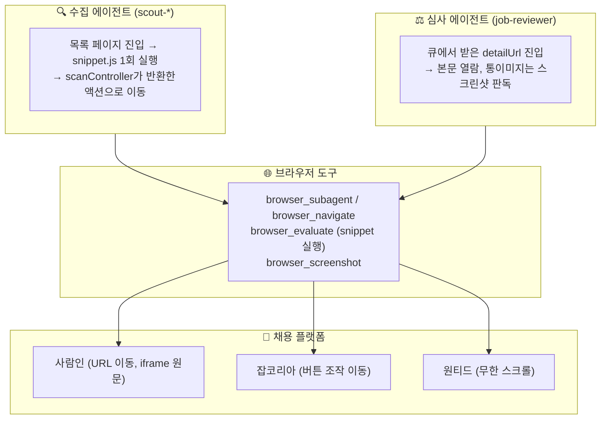

# 4. 브라우징 및 MCP 연동 전략 (Browsing & MCP Strategy)

본 문서는 Antigravity 에이전트 환경에서 브라우저 도구(`browser_subagent`, `browser_evaluate` 등)를 활용하여 **수집 에이전트는 목록을 한 번에 추출**하고, **심사 에이전트는 상세 본문을 열람**하는 브라우징 전략과 플랫폼별 특성을 기술합니다.

---

## 4.1 브라우저 제어 계층 및 도구

```mermaid
flowchart TD
    subgraph Scout ["🔍 수집 에이전트 (scout-*)"]
        ScoutAction["목록 페이지 진입 → snippet.js 1회 실행<br/>→ scanController가 반환한 액션으로 이동"]
    end

    subgraph Reviewer ["⚖️ 심사 에이전트 (job-reviewer)"]
        ReviewAction["큐에서 받은 detailUrl 진입<br/>→ 본문 열람, 통이미지는 스크린샷 판독"]
    end

    subgraph BrowserInterface ["🌐 브라우저 도구"]
        Tools["browser_subagent / browser_navigate<br/>browser_evaluate (snippet 실행)<br/>browser_screenshot"]
    end

    subgraph Targets ["🎯 채용 플랫폼"]
        Saramin["사람인 (URL 이동, iframe 원문)"]
        Jobkorea["잡코리아 (버튼 조작 이동)"]
        Wanted["원티드 (무한 스크롤)"]
    end

    Scout --> Tools
    Reviewer --> Tools
    Tools --> Saramin & Jobkorea & Wanted
```

* **수집**: 에이전트가 스크롤과 DOM 읽기를 반복하지 않고, 플랫폼별 `snippet.js`(`.agents/skills/scout-*/snippet.js`)를 1회 실행해 목록 전체를 JSON으로 받습니다.
* **심사**: 본문 열람은 `job-reviewer`가 담당하며, 임의의 크롤링 스크립트 작성은 금지됩니다.

---

## 4.2 목록 수집 전략 (수집 에이전트)

### 공통 방식
* 목록 추출은 플랫폼별 `snippet.js`를 `browser_evaluate`로 **1회 실행**하여 수행합니다. 스크롤과 DOM 읽기를 반복하지 않습니다.
* 광고 영역 배제는 snippet의 컨테이너 셀렉터가 처리합니다 (사람인 `.common_recruilt_list`, 잡코리아 `#dev-gi-list`, 원티드 `ul[data-cy="job-list"]`).
* `CONTAINER_NOT_FOUND`가 반환되면 1회 재시도 후 오케스트레이터에 보고합니다.
* 추출 결과는 `scanController.js step`에 전달하고, 반환된 액션(`NEXT_PAGE`, `JUMP_PAGE`, `STOP`)에 따라 이동합니다.
* 페이지 이동 방식은 사이트 구조에 따라 다릅니다.

### 사람인 (Saramin) — URL 이동
* 필터가 URL 파라미터에 반영되므로 `page` 값을 바꿔 이동합니다. ID가 최신순으로 단조 감소하는 것이 확인되어 `JUMP_PAGE`(구간 점프)를 허용합니다.

### 잡코리아 (Jobkorea) — 필터 클릭 및 버튼 이동
* 필터와 페이지 상태가 **URL 쿼리 파라미터에 반영되지 않고 페이지 내부 AJAX로만 동작**합니다.
* 기본 URL(`recruit/joblist?menucode=duty`)에 진입한 뒤 `browser_subagent`가 필터 UI(직무, 경력, 기업 형태)를 직접 클릭하고 렌더링 완료를 대기합니다. 클릭 항목의 정확한 값은 [job-criteria.md §4.3](../.agents/rules/job-criteria.md)을 따릅니다.
* 다음 페이지로의 이동도 버튼 조작이며, 서브에이전트가 직접 판단합니다.
* 정렬이 수정/끌올 기준이라 ID가 역전될 수 있어 점프는 비활성이고, 1페이지씩 앵커를 검증합니다.

### 원티드 (Wanted) — 무한 스크롤
* 페이지 맨 아래로 스크롤하고 신규 카드가 로드될 때까지 1~2초 대기한 뒤 `snippet.js`를 다시 실행합니다.
* 잡코리아와 마찬가지로 ID 역전 가능성 때문에 `JUMP_PAGE`는 비활성입니다.

---

## 4.3 본문 열람 전략 (심사 에이전트)

심사 에이전트는 모든 플랫폼에서 큐에서 받은 `detailUrl`로 이동하여 상세 본문, 전형 단계, 마감일을 확인합니다. `detailUrl`은 `jobFilter`가 큐에 적재할 때 공고 ID로 정규화해 만들며, 에이전트가 직접 조립하지 않습니다.

| 플랫폼 | detailUrl |
| :--- | :--- |
| 사람인 | `https://www.saramin.co.kr/zf_user/jobs/relay/view-detail?rec_idx={id}` (iframe 직통) |
| 잡코리아 | `https://www.jobkorea.co.kr/Recruit/GI_Read/{id}` |
| 원티드 | `https://www.wanted.co.kr/wd/{id}` |

### 사람인만 다른 점: iframe 원문 직통
* **문제점**: 사람인 일반 상세 페이지(`relay/view`)는 요강 본문이 별도의 iframe으로 분리되어 있어 메인 페이지 텍스트만 읽으면 자격 요건과 우대 사항이 누락될 수 있음.
* **해결책**: 사람인의 `detailUrl`을 iframe이 불러오는 본문 전용 주소로 만듭니다. 요강과 전형 단계가 단일 DOM으로 노출되므로 별도의 iframe 진입 과정이 필요 없습니다.

### 통이미지/배너 공고 시각적 판독 (Vision Inspection)
* **문제점**: 일부 채용공고에서는 줄글 대신 하나의 커다란 이미지(웹 배너)로 공고를 게시함.
* **해결책**: `browser_screenshot`으로 공고 영역을 캡처하고, 멀티모달 시각 지능(Vision)이 이미지 내의 기술 스택, 전형 절차, 자격 요건, 마감일을 읽어 텍스트 데이터로 정제합니다.

---

## 4.4 봇 탐지 방지 및 안정성 가이드라인

1. **과도한 고주파 요청 방지**:
   - 목록 조회 및 상세 페이지 접근 간 자연스러운 딜레이 유지.
   - 노션 캐시와 `registry`(탈락 이력 포함)를 이용한 `jobFilter` 사전 필터링으로 상세 페이지 방문 횟수를 최소화(신규 건만 방문).
   - 기본 탐색 범위는 트랙당 2페이지(`maxPagesPerTrack`)이며, 점프는 사람인에서만 허용됩니다.
2. **페이지 로드 완료 감지**:
   - `networkidle` 또는 필수 DOM 셀렉터 등장 시점까지 안정적으로 대기하여 불완전한 페이지 파싱 방지.
