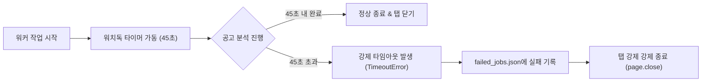

# 6. 하네스 엔지니어링 및 가드레일 (Harness Engineering & Guardrails)

에이전트가 야간에 사람의 개입 없이 홀로 작업을 수행할 때 가장 중요한 것은 **안정성, 복원력(Resilience), 자원 통제**입니다.  
본 문서는 AI 모델과 브라우저 인프라를 안전하게 제어하기 위한 **하네스 엔지니어링(Harness Engineering) 규칙과 안전장치(Guardrails)**를 기술합니다.

---

## 6.1 동시성 제어 및 워커 풀 (Worker Pool Control)

신규 공고가 100개가 발견되더라도 브라우저 탭 100개를 동시에 열면 시스템 리소스가 고갈되고 사이트 차단 위험이 발생합니다.  
따라서 **세마포어(Semaphore) 기반의 워커 풀 패턴**을 엄격히 적용하며, 하루 최대 수집 상한선(`MAX_DAILY_JOBS`)을 두어 과도한 자원 소모를 방지합니다.

```javascript
import pLimit from 'p-limit';

// 1. 일일 최대 등록 상한선 (기본값: 100개)
const MAX_DAILY_JOBS = parseInt(process.env.MAX_DAILY_JOBS || '100', 10);
const targetJobs = newJobQueue.slice(0, MAX_DAILY_JOBS);

// 2. 동시 실행 브라우저 탭 / 워커 수를 3~4개로 엄격 제한
const limit = pLimit(3);

const tasks = targetJobs.map(job => {
  return limit(async () => {
    return await executeTier3WorkerWithRetry(job);
  });
});

await Promise.all(tasks);
```

---

## 6.2 노션 API Rate Limit (초당 3회) 방어 및 지수 백오프 (Exponential Backoff)

노션 API는 초당 약 3회 이상의 과도한 호출 시 `429 Too Many Requests` 에러를 반환합니다.  
100개의 공고를 연속 등록할 때 단 1건의 실패도 없도록 **지수 백오프 자동 재시도 로직**을 적용합니다:

```javascript
async function publishToNotionWithRetry(payload, maxRetries = 3) {
  for (let attempt = 1; attempt <= maxRetries; attempt++) {
    try {
      return await notionClient.pages.create(payload);
    } catch (error) {
      if (error.status === 429 && attempt < maxRetries) {
        const waitTimeMs = Math.pow(2, attempt) * 1000; // 2초, 4초 대기 후 재시도
        console.warn(`[Notion Rate Limit 429] ${waitTimeMs}ms 후 재시도합니다... (시도 ${attempt}/${maxRetries})`);
        await new Promise(r => setTimeout(r, waitTimeMs));
        continue;
      }
      throw error;
    }
  }
}
```


---

## 6.3 서킷 브레이커 및 워치독 타이머 (Circuit Breaker & Watchdog)


에이전트가 무한 로딩 중인 페이지에 갇히거나, 팝업 닫기를 반복하며 무한 루프에 빠지는 것을 원천 차단합니다.



1. **단일 작업 타임아웃 (Per-Job Timeout)**:
   - 공고 1건당 최대 허용 시간을 **45초**로 제한합니다. 45초가 지나면 에이전트를 강제 종료하고 해당 공고를 `failed_jobs.json`에 기록한 뒤 다음 공고로 넘어갑니다.
2. **사이트별 서킷 브레이커 (Circuit Breaker)**:
   - 특정 플랫폼(예: 잡코리아)에서 연속 3회 이상 타임아웃이나 CAPTCHA 차단이 감지되면, 해당 사이트 수집을 즉시 중단(Trip)하고 다른 플랫폼(원티드 등) 수집으로 우회합니다. 전체 배치가 중단되는 것을 방지합니다.

---

## 6.3 브라우저 탭 및 메모리 누수 방지 (Resource Cleanup)

Playwright 조작 시 예외가 발생하더라도 브라우저 탭이 백그라운드에 좀비 프로세스로 남지 않도록 항상 `finally` 블록에서 탭을 닫습니다.

```javascript
async function executeTier3Worker(jobUrl) {
  let page = null;
  try {
    page = await browserContext.newPage();
    // 공고 수집 및 노션 등록 로직 실행...
  } catch (error) {
    console.error(`[Worker Error] ${jobUrl}:`, error.message);
    recordFailedJob(jobUrl, error);
  } finally {
    if (page) {
      await page.close().catch(() => {}); // 어떤 경우에도 탭 리소스 반환
    }
  }
}
```

---

## 6.4 토큰 비용 최적화 (Token Economy)

에이전트에게 불필요한 웹페이지 전체 HTML(헤더, 푸터, 광고 스크립트 등 수만 줄)을 그대로 넘기면 토큰 비용이 폭증하고 추론 속도가 느려집니다.

* **DOM 가지치기 (Pruning)**:
  - 브라우저에서 `script`, `style`, `svg`, `header`, `footer`, `nav` 태그를 제거하고, 오직 채용 본문 영역(`.job-content`, `.user_content`)의 텍스트만 추출하여 LLM에게 전달합니다.
* **초경량 고성능 모델 사용**:
  - 일상적인 텍스트 파싱 및 분류에는 **Gemini 3.8 Flash** 또는 동급 경량 모델을 사용하여 건당 비용을 0.001달러 미만으로 유지합니다.
* **불필요한 스크린샷 억제**:
  - 텍스트가 정상 추출된 공고는 `browser_screenshot`을 아예 호출하지 않고, 텍스트가 비어 있는 통이미지 공고에만 선택적으로 멀티모달 비전을 가동합니다.

---

## 6.5 실패 감사 및 로깅 (Audit Trail)

야간 작업이 끝난 후 아침에 실행 결과를 투명하게 검토할 수 있도록 로그를 체계화합니다.

* `logs/run-YYYY-MM-DD.log`: 전체 작업 진행 타임라인 기록
* `logs/failed_jobs.json`: 실패한 공고 URL 및 실패 사유 (타임아웃, 차단 등)
* `logs/skipped_jobs.json`: 웹 개발 직무가 아니라서 자동 제외된 공고 기록
