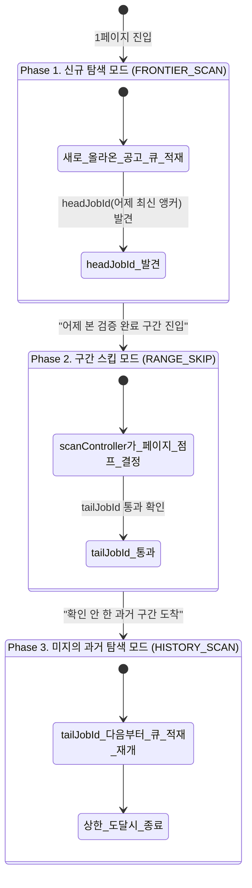

# 6. 하네스 엔지니어링 및 가드레일 (Harness Engineering & Guardrails)

본 문서는 Antigravity 멀티 에이전트 시스템이 야간에 자율적으로 동작할 때 발생할 수 있는 **API 한도 초과, 무한 루프, 사이트 차단, 리소스 고갈**을 방어하기 위한 안전장치(Guardrails)와 복원력(Resilience) 설계를 기술합니다.

---

## 6.1 노션 API Rate Limit (초당 3회) 방어 및 재시도

* **위험 요소**: 노션 API는 초당 3회 이상의 연속 요청 시 `429 Too Many Requests`를 반환하며 일시 차단됩니다.
* **방어 로직 ([tools/publishRun.js](../tools/publishRun.js), [tools/notionJobPublisher.js](../tools/notionJobPublisher.js))**:
  - `publishRun`이 배치 발행 시 공고 간 350ms 간격으로 순차 등록합니다.
  - `429` 응답 시 `Retry-After` 헤더(없으면 1초)만큼 대기 후 최대 3회 재시도합니다 (`notionJobPublisher`).
  - 그래도 실패한 공고는 `data/retry.jsonl`에 누적하여 다음 세션에서 재시도 대상으로 이월합니다. `publishRun` 종료 코드 2는 일부 실패를 뜻하며 파이프라인은 계속 진행됩니다.

---

## 6.2 사전 중복 필터링 (Pre-filter Deduplication)

* **원칙**: 이미 처리된 공고는 상세 본문 브라우징(토큰/네트워크 소모)을 거치지 않고, 목록 단계에서 **`jobFilter`가 코드로 건너뜁니다**. 대조 대상은 `registry`(등록, 탈락, 실패 이력)와 노션 캐시이며, 노션의 `공고키`(`플랫폼명:공고id`)를 가장 먼저 사용합니다. 판정 순서는 [05-notion-schema-and-sync.md §5.4](05-notion-schema-and-sync.md)를 참고하세요.
* **교차 플랫폼 중복**: 같은 기업이면서 제목이 유사한 공고는 `SUSPECT`로 표시하여 심사관에게 힌트를 주고, 발행 단계에서 `publishRun`이 1건만 등록합니다.
* **재공고 판별**:
  - 기존 등록 공고의 상태가 `마감`인 경우, 기업이 포지션을 재오픈한 것으로 판단하여 "재수집"을 허용합니다.
  - 기존 공고가 `마감`이 아닌 상태이거나 레지스트리에 이력이 있으면 중복으로 건너뜁니다.

---

## 6.3 브라우저 세션 및 메모리 통제

1. **탭 수명 주기 관리**:
   - 상세 공고 확인이 끝난 브라우저 탭은 즉시 닫거나 재사용하여 메모리 누수를 방지합니다.
2. **타임아웃 가드레일**:
   - 단일 페이지 내비게이션 타임아웃(기본 30초) 설정.
   - 특정 공고 로딩 지연 시 전체 배치가 중단되지 않고 해당 건만 에러 로깅 후 다음 공고로 격리 진행.

---

## 6.4 실행 세션 격리 및 에러 알림

* **세션 잠금 (`tools/runLock.js`)**:
  - 다중 실행이 겹쳐 동일 체크포인트나 큐를 동시에 건드리지 않도록 상호 배제 잠금을 유지합니다. 세션 시작 시 `acquire`, 종료 시 `release`합니다.
* **상태의 파일 영구화**:
  - 목록, 심사 큐, 심사 결과를 `data/runs/{runId}/` 아래 JSON 파일에 저장하므로, 중단되어도 어디까지 진행했는지 파악할 수 있습니다. 심사 큐 항목은 30분 임대(Lease)로 배분되어 심사 에이전트가 죽어도 다시 대기 상태가 됩니다.
* **완주 감시 (`tools/watchdog.js`)**:
  - 세션 폴더에 `summary.json`과 `report_sent.json`이 모두 있는지 검사하여, 없으면 비정상 종료로 보고 디스코드로 알립니다.
* **에러 격리 및 디스코드 알림**:
  - 수집 중 예외가 발생하더라도 파이프라인이 묵살되지 않고, 실패 단계와 원인을 디스코드 장애 알림(`--error`)으로 투명하게 전달합니다.

---

## 6.5 3단계 구간 점프 상태 머신 (Range Window Skipping & Fast-Forward)

야간 자율 실행 및 반복 수집 시 **이미 검증 완료된 중간 구간(예: 2~5페이지)을 불필요하게 재탐색하지 않고 초고속으로 건너뛰어(Jump), 아직 한 번도 확인하지 못한 미지의 과거 공고로 직행**하는 자율 복원력 아키텍처입니다.


```mermaid
stateDiagram-v2
    [*] --> 1_신규_탐색_모드 : 1페이지 진입

    state "Phase 1. 신규 탐색 모드 (FRONTIER_SCAN)" as 1_신규_탐색_모드 {
        [*] --> 새로_올라온_공고_큐_적재
        새로_올라온_공고_큐_적재 --> headJobId_발견 : headJobId(어제 최신 앵커) 발견
    }

    1_신규_탐색_모드 --> 2_구간_스킵_모드 : "어제 본 검증 완료 구간 진입"

    state "Phase 2. 구간 스킵 모드 (RANGE_SKIP)" as 2_구간_스킵_모드 {
        [*] --> scanController가_페이지_점프_결정
        scanController가_페이지_점프_결정 --> tailJobId_통과 : tailJobId 통과 확인
    }

    2_구간_스킵_모드 --> 3_미지의_과거_탐색_모드 : "확인 안 한 과거 구간 도착"

    state "Phase 3. 미지의 과거 탐색 모드 (HISTORY_SCAN)" as 3_미지의_과거_탐색_모드 {
        [*] --> tailJobId_다음부터_큐_적재_재개
        tailJobId_다음부터_큐_적재_재개 --> 상한_도달시_종료
    }
```

* 상태머신은 `scanController.js`가 코드로 구동하며, 에이전트는 반환된 액션만 수행합니다. 본문 열람과 심사는 이 단계에서 하지 않고, 신규 공고를 심사 큐에 적재하기만 합니다.
* 점프(`JUMP_PAGE`)는 사람인만 허용됩니다. 잡코리아와 원티드는 ID가 역전될 수 있어 1페이지씩 앵커를 검증합니다. 목록 안의 ID 역전은 `ID_INVERSION`으로 검증합니다.

### 1. 3중 앵커 윈도우 (3-Anchor Window) 엣지 케이스 방어
* **위험**: 앵커 공고 1개가 채용 조기 마감 등으로 삭제될 경우 앵커를 놓치고 지나칠 수 있음.
* **해결책**: 직전 세션의 최상단 공고 3개(`headWindow`)와 최하단 공고 3개(`tailWindow`)를 윈도우로 보관하여, 셋 중 하나라도 일치하면 워터마크 히트로 인식합니다.

### 2. 체크포인트 분리 메타데이터 규격 (`data/checkpoints/{site}/{track}.json`)
사이트별·트랙별 충돌 방지 및 독립적 관리를 위해 개별 파일로 분리하여 관리합니다. 수집 중에는 `data/runs/{runId}/{site}_{track}/proposed_checkpoint.json`에 제안값만 기록하고, 세션이 정상 완주한 뒤 `checkpointManager.js commit --run`으로 반영하므로 중도 실패가 체크포인트를 오염시키지 않습니다.

* **원티드**: `data/checkpoints/wanted/track2.json`
* **사람인**: `data/checkpoints/saramin/track1.json`, `data/checkpoints/saramin/track2.json`
* **잡코리아**: `data/checkpoints/jobkorea/track1.json`, `data/checkpoints/jobkorea/track2.json`

**개별 파일 규격 예시 (`data/checkpoints/saramin/track1.json`)**:
```json
{
  "site": "saramin",
  "track": "track1",
  "headJobId": "55053325",
  "headWindow": ["55053325", "55053324", "55036577"],
  "tailJobId": "55002287",
  "tailWindow": ["55002287", "55000563", "54998016"],
  "tailPageHint": 4,
  "updatedAt": "2026-09-16T21:34:00+09:00"
}
```

### 3. 무중단 야간 실행 효과
- **불필요한 중복 본문 로딩 감소**: 이미 검증한 구간의 공고는 상세 iframe/새 탭을 열지 않고 목록 ID만 확인합니다. (점프 허용은 사람인만 해당하며, 잡코리아와 원티드는 1페이지씩 앵커를 검증합니다.)
- **신규 공고 탐색**: 1페이지부터 앵커를 만날 때까지 새로 올라온 공고를 수집합니다.
- **과거 영역 자동 확장 (Backfill)**: 매 세션마다 앵커 꼬리(`tailJobId`) 뒤쪽의 새로운 과거 페이지를 안정적으로 누적 탐색합니다.

### 4. 세션 종료 기준 (Stop Reasons)
`scanController`가 아래 사유로 `STOP`을 반환하며, 상한값은 [config/pipeline.json](../config/pipeline.json)에서 조정합니다.
- **`LIMIT_PAGES`**: 트랙당 탐색 페이지 상한(`maxPagesPerTrack`, 기본 2) 도달. 사용자가 범위 확장을 명시하면 늘려서 진행합니다.
- **`LIMIT_QUEUED`**: 트랙당 큐 적재 상한(`maxQueuedPerTrack`, 기본 80) 도달. Phase 2 구간은 `maxPhase2Pages`로도 제한됩니다.
- **`LIST_END`**: 플랫폼의 마지막 페이지 도달.
- **`EMPTY_PAGE`**: 빈 페이지가 반환됨.
- **`FILTER_MISMATCH`**: 현재 페이지에 적용된 필터가 기대 필터와 다름 (`expectedFilters` 불일치).
- **`CONTAINER_NOT_FOUND`**: snippet이 목록 컨테이너를 찾지 못함 (1회 재시도 후 보고).
