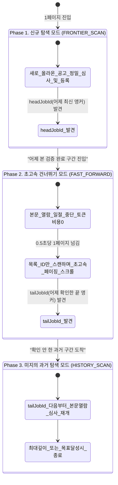

# 6. 하네스 엔지니어링 및 가드레일 (Harness Engineering & Guardrails)

본 문서는 Antigravity 멀티 에이전트 시스템이 야간에 자율적으로 동작할 때 발생할 수 있는 **API 한도 초과, 무한 루프, 사이트 차단, 리소스 고갈**을 방어하기 위한 안전장치(Guardrails)와 복원력(Resilience) 설계를 기술합니다.

---

## 6.1 노션 API Rate Limit (초당 3회) 방어 및 지수 백오프

* **위험 요소**: 노션 API는 초당 3회 이상의 연속 요청 시 `429 Too Many Requests`를 반환하며 일시 차단됩니다.
* **방어 로직 ([tools/notionJobPublisher.js](../tools/notionJobPublisher.js))**:
  - 배치 등록 시 공고 간 최소 500ms~1000ms의 완충 대기 시간을 둡니다.
  - `429` 또는 일시적 네트워크 에러 발생 시 최대 3회까지 지수 백오프(`2^attempt * 1000ms`) 후 재시도합니다.

---

## 6.2 패스스루 중복 방지 (Fast Passthrough Deduplication)

* **원칙**: 이미 수집되어 노션에 등록된 공고는 상세 본문 브라우징(토큰/네트워크 소모)을 거치지 않고 **0.001초 만에 즉시 건너뜁니다**.
* **재공고 판별**:
  - 기존 등록 공고의 상태가 `마감`인 경우, 기업이 포지션을 재오픈한 것으로 판단하여 "재수집"을 허용합니다.
  - 기존 공고가 `미지원` 또는 진행 중인 활성 상태인 경우 중복 수집을 원천 차단합니다.

---

## 6.3 브라우저 세션 및 메모리 통제

1. **탭 수명 주기 관리**:
   - 상세 공고 확인이 끝난 브라우저 탭은 즉시 닫거나 재사용하여 메모리 누수를 방지합니다.
2. **타임아웃 가드레일**:
   - 단일 페이지 내비게이션 타임아웃(기본 30초) 설정.
   - 특정 공고 로딩 지연 시 전체 배치가 중단되지 않고 해당 건만 에러 로깅 후 다음 공고로 격리 진행.

---

## 6.4 백그라운드 스케줄러 데몬 안전성

* **데몬 모드 (`IsDaemon=true`)**:
  - 현재 채팅 세션이 완료되거나 사용자가 대화창을 닫아도, IDE 백그라운드 프로세스로 cron 스케줄이 온전히 유지됩니다.
* **에러 격리 및 디스코드 알림**:
  - 수집 중 예외가 발생하더라도 작업이 크래시되지 않고, 실패 건수와 에러 내용을 일일 디스코드 리포트에 투명하게 기록합니다.

---

## 6.5 3단계 구간 점프 상태 머신 (Range Window Skipping & Fast-Forward)

야간 자율 실행 및 반복 수집 시 **이미 검증 완료된 중간 구간(예: 2~5페이지)을 불필요하게 재탐색하지 않고 초고속으로 건너뛰어(Jump), 아직 한 번도 확인하지 못한 미지의 과거 공고로 직행**하는 자율 복원력 아키텍처입니다.


```mermaid
stateDiagram-v2
    [*] --> 1_신규_탐색_모드 : 1페이지 진입

    state "Phase 1. 신규 탐색 모드 (FRONTIER_SCAN)" as 1_신규_탐색_모드 {
        [*] --> 새로_올라온_공고_정밀_심사_및_등록
        새로_올라온_공고_정밀_심사_및_등록 --> headJobId_발견 : headJobId(어제 최신 앵커) 발견
    }

    1_신규_탐색_모드 --> 2_초고속_건너뛰기_모드 : "어제 본 검증 완료 구간 진입"

    state "Phase 2. 초고속 건너뛰기 모드 (FAST_FORWARD)" as 2_초고속_건너뛰기_모드 {
        [*] --> 본문_열람_일절_중단_토큰비용0
        본문_열람_일절_중단_토큰비용0 --> 목록_ID만_스캔하며_초고속_페이징_스크롤 : 0.5초당 1페이지 넘김
        목록_ID만_스캔하며_초고속_페이징_스크롤 --> tailJobId_발견 : tailJobId(어제 확인한 끝 앵커) 발견
    }

    2_초고속_건너뛰기_모드 --> 3_미지의_과거_탐색_모드 : "확인 안 한 과거 구간 도착"

    state "Phase 3. 미지의 과거 탐색 모드 (HISTORY_SCAN)" as 3_미지의_과거_탐색_모드 {
        [*] --> tailJobId_다음부터_본문열람_심사_재개
        tailJobId_다음부터_본문열람_심사_재개 --> 최대깊이_또는_목표달성시_종료
    }
```

### 1. 3중 앵커 윈도우 (3-Anchor Window) 엣지 케이스 방어
* **위험**: 앵커 공고 1개가 채용 조기 마감 등으로 삭제될 경우 앵커를 놓치고 지나칠 수 있음.
* **해결책**: 직전 세션의 최상단 공고 3개(`anchorWindow: [id1, id2, id3]`)와 최하단 공고 3개를 슬라이딩 윈도우로 보관하여, 셋 중 하나라도 일치하면 즉시 워터마크 히트로 인식하여 100% 정합성을 보장합니다.

### 2. 체크포인트 메타데이터 규격 (`data/checkpoint.json`)
```json
{
  "saramin_track1": {
    "headJobId": "55053325",
    "headWindow": ["55053325", "55053324", "55036577"],
    "tailJobId": "55002287",
    "tailWindow": ["55002287", "55000563", "54998016"],
    "updatedAt": "2026-09-16T21:34:00+09:00"
  },
  "wanted_frontend": {
    "headJobId": "387266",
    "headWindow": ["387266", "386951", "376185"],
    "tailJobId": "293447",
    "tailWindow": ["293447", "378371", "376228"],
    "updatedAt": "2026-09-16T21:34:00+09:00"
  }
}
```

### 3. 무중단 야간 실행 효과
- **불필요한 중복 본문 로딩 90% 차단**: 이미 검증한 2~5페이지 수십 개 공고는 상세 iframe/새 탭을 일절 열지 않고 목록 ID만 확인하여 2~3초 만에 텔레포트합니다.
- **신규 공고 전수 조사 (누락 0%)**: 1페이지부터 앵커를 만날 때까지 새로 올라온 공고를 완벽하게 흡수합니다.
- **과거 영역 자동 확장 (Backfill)**: 매 세션마다 앵커 꼬리(`tailJobId`) 뒤쪽의 새로운 과거 페이지를 안정적으로 누적 탐색합니다.

### 4. 세션 안전 종료 기준 (Safety Termination Limits)
- **누적 검토 2,000건 초과 시 안전 자동 종료 (`totalScanned > 2000`)**: 무한 루프, 메모리 누수 및 브라우저 프로세스 과부하를 방지하기 위해 단일 세션에서 스캔한 누적 공고가 2,000건을 초과하면 즉시 심사 통과분을 노션에 등록하고 앵커를 저장한 후 세션을 정상 종료합니다.
- **사용자 목표치 달성**: 사용자가 명시한 목표 수량 달성 시 즉시 종료.
- **플랫폼 끝 도달**: 플랫폼의 마지막 과거 페이지 도달 시 종료.
