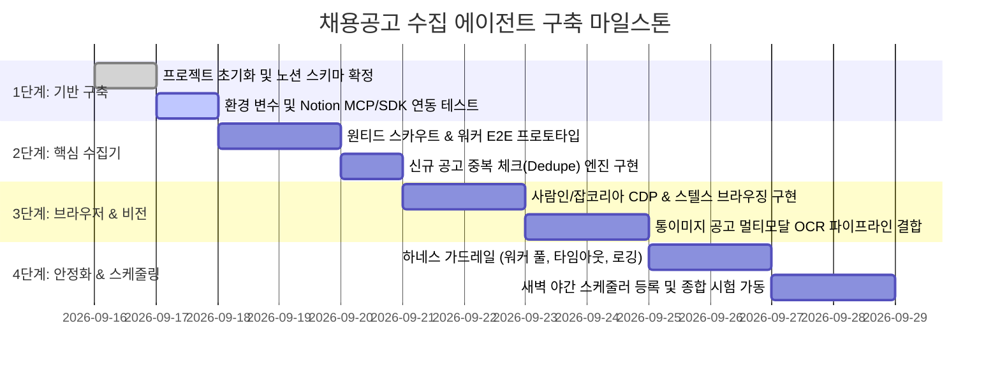

# 7. 구현 로드맵 및 운영 런북 (Roadmap & Runbook)

본 문서는 프로젝트의 **점진적 구현 마일스톤(단계별 계획)**과 **환경 설정 및 실행 방법(Runbook)**을 정리한 가이드입니다.

---

## 7.1 구현 로드맵 (Milestones)



---

## 7.2 프로젝트 디렉토리 구조 제안

```text
채용공고 스크랩/
├── docs/                      # 📚 설계 및 아키텍처 문서 모음
│   ├── 01-overview.md
│   ├── 02-system-architecture.md
│   ├── 03-agent-specifications.md
│   ├── 04-browsing-and-mcp-strategy.md
│   ├── 05-notion-schema-and-sync.md
│   ├── 06-harness-engineering.md
│   └── 07-roadmap-and-runbook.md
├── src/
│   ├── orchestrator.js        # Tier 1 총괄 관리자
│   ├── scouts/                # Tier 2 사이트별 목록 스카우트
│   │   ├── wantedScout.js
│   │   ├── saraminScout.js
│   │   └── jumpitScout.js
│   ├── workers/               # Tier 3 공고 상세 분석 워커
│   │   ├── jobAnalyzer.js
│   │   └── visionOcr.js
│   ├── notion/                # 노션 API / MCP 인터페이스
│   │   ├── notionClient.js
│   │   └── templateBuilder.js
│   └── utils/                 # 가드레일, URL 정규화, 로거
│       ├── dedupe.js
│       ├── poolLimit.js
│       └── logger.js
├── logs/                      # 실행 로그 및 실패 공고 기록
├── .env.example               # 환경 변수 템플릿
├── package.json
└── README.md
```

---

## 7.3 환경 변수 설정 (.env)

```env
# Notion 연동 키
NOTION_API_KEY=ntn_xxxxxxxxxxxxxxxxxxxxxxxxx
NOTION_DATABASE_ID=343831b8-54df-8081-adb8-e6c93fc69e37

# 브라우저 실행 모드 ('cdp' 또는 'persistent')
BROWSER_MODE=persistent
CHROME_CDP_URL=http://localhost:9222
USER_DATA_DIR=./.chrome-profile

# 실시간 알림 (디스코드 웹훅)
DISCORD_WEBHOOK_URL=https://discord.com/api/webhooks/...

# 하네스 설정
MAX_CONCURRENT_WORKERS=3
PER_JOB_TIMEOUT_MS=45000
```

### 7.3.1 디스코드 웹훅 알림 메시지 포맷 (Embed Sample)
새벽 수집이 완료되면 스마트폰/PC 디스코드로 다음과 같은 고급 임베드 카드가 도착합니다:
```json
{
  "username": "채용공고 스크랩 에이전트 🏢",
  "embeds": [
    {
      "title": "🌅 오늘의 웹개발 채용공고 수집 완료 리포트",
      "color": 3447003,
      "description": "오늘 새벽 탐색 및 노션 DB 저장이 정상 완료되었습니다.",
      "fields": [
        { "name": "📊 수집 통계", "value": "• 총 탐색: 48건\n• 신규 등록: **6건**\n• 마감 후 재오픈: **1건**\n• 기존 활성 스킵: 41건", "inline": false },
        { "name": "✨ 오늘 발굴된 주요 신규 공고", "value": "1. [미리디] [미리캔버스] 백엔드 개발자\n2. [토스] 프론트엔드 플랫폼 엔지니어\n3. [당근] 커머스 웹 프론트엔드 개발자", "inline": false }
      ],
      "footer": { "text": "🗃️ 공고 분석 데이터베이스를 확인하세요!" }
    }
  ]
}
```


---

## 7.4 실행 런북 (Runbook)

### 1) 사전 의존성 설치
```powershell
npm install
npx playwright install chromium
```

### 2) 테스트 1회 수집 실행
```powershell
# 단일 사이트(예: 원티드) 1~2개 공고 즉시 테스트
npm run test:single
```

### 3) 전체 배치 실행 (새벽 수집 모의 실행)
```powershell
npm run start
```

### 4) 야간 자동 스케줄링 등록 (Windows 작업 스케줄러 예시)
* 매일 새벽 02:00에 무인 실행되도록 Windows 작업 스케줄러에 등록:
```powershell
# PowerShell 스크립트로 백그라운드 등록
$Action = New-ScheduledTaskAction -Execute "node.exe" -Argument "src/orchestrator.js" -WorkingDirectory "C:\Users\yeonn\Documents\Yeon\Project\채용공고 스크랩"
$Trigger = New-ScheduledTaskTrigger -Daily -At 2:00AM
Register-ScheduledTask -TaskName "JobScrapingNightlyAgent" -Action $Action -Trigger $Trigger -Description "채용공고 자동 수집 및 노션 등록 에이전트"
```
* 또는 Antigravity의 `/schedule` 기능을 통해 IDE 내부에서 스케줄을 유지할 수도 있습니다.
