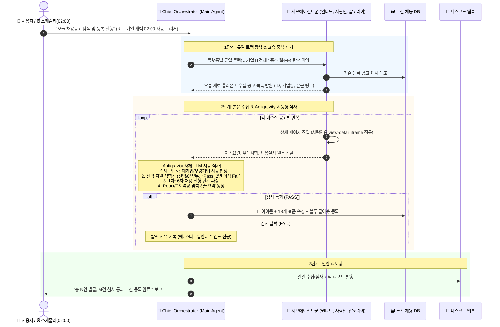

# Antigravity 네이티브 멀티 에이전트 하이브리드 워크플로우

> **문서 상태**: **FINAL (공식 아키텍처 규격)**  
> **최종 갱신일**: 2026-09-16  
> **시스템 정의**: 고속 카테고리 필터링 탐색(Hands) + Antigravity 지능형 심사 및 전형 분해(Brain)의 2단계 하이브리드 멀티 에이전트 파이프라인

---

## 1. 핵심 철학: Brain & Hands의 완벽한 분리

1. **손발 (플랫폼별 서브에이전트 스킬)**:
   - 각 채용 사이트의 공식 **직업/직무 카테고리 + 경력(신입/경력무관)** 필터 URL로 직접 진입.
   - 노션 기존 등록 캐시와 대조하여 이미 등록된 공고는 **0.001초 만에 스킵(Fast-forward Passthrough)**.
2. **뇌 (Antigravity Chief Orchestrator)**:
   - 비정형 공고 본문 전체를 읽고, **스타트업(웹 FE/풀스택 필수) vs 대기업(일반 SW/IT 포괄)** 심사 평가 기준을 자율 판정.
   - 1차~6차 채용 전형 단계를 정밀 분해하고 React/TypeScript 맞춤 AI 3줄 요약 작성.

---

## 2. 전체 멀티 에이전트 워크플로우

---

## 3. 사이트별 공식 탐색 규격 요약

| 플랫폼 | 트랙 1: 대기업 / 우량기업 | 트랙 2: 중소 / 스타트업 |
| :--- | :--- | :--- |
| **사람인 (Saramin)** | 대기업, 중견, 1000대기업 ➔ **IT개발·데이터 전체** (`cat_mcls=2`) & 신입/무관 | 중소, 스타트업 ➔ **웹개발(`87`), 프론트(`92`), 퍼블리셔(`91`)** & 신입/무관 |
| **잡코리아 (Jobkorea)** | 대기업, 30대그룹, 중견, 1000대, 강소 ➔ **개발 주요 직군 전체** & 신입/무관 | 중소, 벤처, 코스피, 코스닥 ➔ **웹개발, 프론트, 퍼블리셔** & 신입/무관 |
| **원티드 (Wanted)** | 스타트업/성장기업 중심 ➔ **개발 직군 웹 개발자(`873`), 프론트엔드 개발자(`669`)** & 신입/0년차 | - |

---

## 4. 정기 자동 스케줄링 운영

* **실행 시각**: 매일 새벽 02:00 KST (`CronExpression: 0 2 * * *`, Background Daemon)
* **등록 태스크**: `task-364`
* **사용자 명령어**: `/schedule`을 통해 언제든 주기 및 시간 재조정 가능
